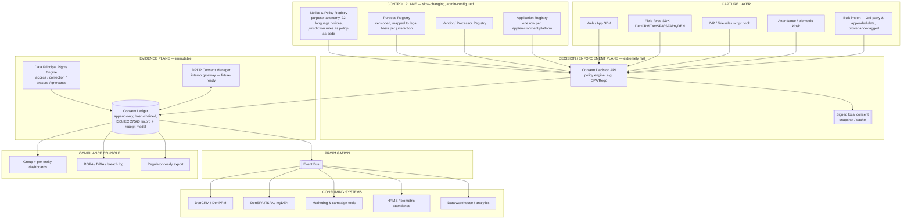

# UDS Group Consent & Privacy Control Plane
## Final Architecture & Delivery Plan

*Prepared for: Updater Services Limited (UDS) group | Version 1.0 | 15 August 2026*
*Synthesized from three independent research passes (deep-research report, architecture plan, and engineering plan) plus fresh verification against current sources.*

---

## How This Document Was Built

You gave me three prior plans on the same problem. Rather than pick one, I read all three end to end, kept what was strongest in each, cross-checked every load-bearing fact against current sources (since regulatory dates, UDS's corporate structure, and the EU's Digital Omnibus have all moved in the last few months), and corrected a few things that had drifted. Here's what each source contributed:

- **Plan A (deep-research report)** — the cleanest statement of the baseline legal requirements (DPDP/GDPR consent validity, ROPA, audit trail) and a sensible, conventional microservices architecture. Good foundation, but treats UDS as a single organisation with one consent problem, which undersells the actual scope.
- **Plan B (architecture plan)** — the sharpest read on *why UDS specifically* is harder than a normal CMP deployment (multi-entity, multi-jurisdiction, field-force and BPO touchpoints, purchased/appended contact data), with well-sourced regulatory detail and a standards-first data model (ISO/IEC 27560, W3C DPV, the Account Aggregator consent-artefact precedent).
- **Plan C (engineering plan)** — the deepest engineering thinking: the control-plane/enforcement-plane/evidence-plane split, offline-first field-app support, signed local consent snapshots for sub-millisecond checks, policy-as-code, and a genuinely useful discovery questionnaire for kicking off requirements gathering.

This document keeps Plan C's architectural philosophy as the spine, Plan B's regulatory rigor and multi-entity framing as the compliance layer, and Plan A's baseline checklist as a sanity backstop — then updates every date and fact to what's actually true as of today, and adds a few things none of the three had (current DPDP Board staffing status, the EU Digital Omnibus's actual state after June 2026, verified UDS ownership percentages, and Denave's own recent AI-driven strategy shift, which matters for a governance module you'll want anyway).

---

## 1. Executive Summary

**Don't build a cookie-banner product. Build an internal Consent & Privacy Control Plane** — a centralized service that every UDS company and application calls to ask "can I do this with this person's data," instead of each subsidiary bolting a consent tool onto its own stack (or continuing to rely on a single-tenant SaaS product like KavachOne's ConsentiQo, which is built for one organisation with one set of digital touchpoints).

**The core design principle:** *centralized policy and evidence, distributed, fast, local enforcement.* Every application asks one system for a decision; that decision is cached locally so it doesn't add latency; every decision and every change is written to an immutable ledger that can answer an audit question in seconds, not a data-pull project.

**Why this is a genuinely different problem than "add a consent banner":** UDS is a listed parent with nine group entities (not counting Denave's five international step-down subsidiaries) spanning integrated facilities management, sales enablement, background verification, mailroom/logistics, catering, hygiene services, airport ground handling, and BPO — each a plausible independent Data Fiduciary under India's DPDP Act, each with different touchpoints (websites, mobile apps, IVR/telesales scripts, retail-audit tablets, biometric attendance kiosks, background-check portals), and at least one subsidiary (Denave) that both processes data on behalf of its own enterprise clients *and* runs its own purchased/appended contact databases — a consent-provenance problem almost no off-the-shelf consent tool is built to handle.

**Regulatory timing gives you a real, external deadline, not an arbitrary one:** India's DPDP Rules, 2025 were notified on 13–14 November 2025 and roll out in three phases — Consent Manager registration opens **13 November 2026**, and full substantive compliance (notice, consent, security safeguards, data-principal rights) is mandatory by **13 May 2027**. That's your build clock.

**Recommended approach: hybrid, not full custom, not off-the-shelf.** Reuse mature open-source components for the thin, well-solved edges (the actual consent-banner widget, cookie/tracker discovery); build the orchestration core yourself — Purpose Registry, Consent Ledger, Decision API, multi-entity data model, provenance tracking — because that core *is* the product UDS actually needs, and nothing on the market is scoped to solve it as a group-wide, multi-jurisdiction, offline-capable system.

---

## 2. UDS Group — Verified Corporate & Data Landscape

### 2.1 Current group structure

I re-verified this directly against UDS's investor-relations filings rather than relying on the earlier plans' assumptions, since ownership percentages and the entity list have shifted over the past two years.

| Entity | UDS ownership | What it does | Why it matters for consent design |
|---|---|---|---|
| **Updater Services Ltd (UDS)** | Listed parent (NSE, ~₹640 cr IPO, Sept 2023) | Integrated Facilities Management (IFM, majority of revenue) + Business Support Services (BSS) | Each subsidiary below is a separately reportable entity — consent records must be entity-attributable, and the group dashboard is a rollup view, not the system of record |
| **Denave India Pvt Ltd** | 89.57% | Sales enablement: demand generation, telesales, field sales/marketing, retail audits, digital marketing, data/database services — for enterprise clients across IT, FMCG, consumer durables, BFSI | Runs **DenCRM, DenPRM, DenSFA/iSFA, myDEN Connect, DenTrack**. Has 5 international step-down subsidiaries (UK, Malaysia, Singapore ×2, Korea) — each its own jurisdiction. Two stacked consent problems: (a) consent for Denave's own field-force/CRM users, (b) **provenance** for third-party/purchased/appended contact data used in campaigns on behalf of clients |
| **Matrix Business Services India Pvt Ltd** | 100% | Employee background verification and business assurance | Touches identity, criminal-history, and employment-history data — DPDP has no formal "sensitive data" tier, but this is exactly the processing class that draws first regulatory scrutiny |
| **Avon Solutions & Logistics Pvt Ltd** | 76% | Mailroom management; logistics/brokerage vertical was halted in Q3 FY26 after a ₹23 cr receivables provision — core mailroom business continues | Smaller near-term consent surface, but still a distinct Data Fiduciary entity |
| **Global Flight Handling Services Pvt Ltd** | 83.25% | Airport/airline ground support | Frontline workforce data, biometric access-control at airside facilities |
| **Fusion Foods and Catering Services Pvt Ltd** | 100% | Institutional/corporate catering | Facility-level workforce data |
| **Washroom Hygiene Concepts Pvt Ltd** | 100% | Washroom/feminine hygiene services | Facility-level and B2B customer data |
| **Athena BPO Private Ltd** | 73.50% | Inbound/outbound contact centre, back-office, data processing | Handles customer call records and data on behalf of Athena's own clients — a processor-role consent problem |
| **Wynwy Technologies Pvt Ltd** | 100% | Business/staffing operations (merged from Integrated Technical Staffing & Solutions in FY24–25) | Illustrates that UDS's legal-entity map changes through M&A — the platform must treat entities as configuration, not hard-coded structure |
| **Updater Services (UDS) Foundation** | 100% | Section 8 group CSR foundation | Lower consent surface, included for completeness of the entity registry |

Two smaller entities (Tangy Supplies & Solutions, Stanworth Management) were absorbed into UDS itself via a merger effective May 2025 — another live example of why entity onboarding needs to be a first-class, repeatable workflow rather than a one-off integration project each time.

### 2.2 The four consent problems wearing one trenchcoat

UDS's consent problem is really four different problems, and any plan that only solves the first one — which is what most CMPs, including Kavach, are built for — will look compliant on a website while remaining exposed everywhere else:

1. **Digital/marketing consent** for Denave's own campaigns and website/app touchpoints.
2. **Product-embedded consent** inside DenCRM, DenSFA, iSFA, and myDEN — a field rep's app should not be able to pull a contact's phone number for a purpose that was never consented to.
3. **Workforce consent** across a large, distributed, partly blue-collar employee base (IFM staff, catering staff, airport ground crew) — including biometric attendance, which several jurisdictions now treat as sensitive data even where India's DPDP does not yet formally classify it that way.
4. **Consent provenance** for third-party and purchased/appended contact data — specifically Denave's data-services business, which is the one exposure that almost no commercial CMP, including Kavach, is built to track at all.

---

## 3. Regulatory Landscape (verified as of 15 August 2026)

### 3.1 India — DPDP Act, 2023 + DPDP Rules, 2025 (the primary driver)

The Ministry of Electronics and Information Technology notified the DPDP Rules, 2025 on **13 November 2025** (Gazette G.S.R. 846(E), published 14 November 2025), operationalising the Act's provisions on consent, notice, data-principal rights, and breach reporting. Rollout is staggered across three phases:

| Phase | Date | What activates |
|---|---|---|
| **Phase 1** | 13 Nov 2025 (immediate) | Data Protection Board of India (DPBI) constituted as a body corporate; core definitions live |
| **Phase 2** | **13 Nov 2026** | Consent Manager registration opens; enforcement powers and the penalty framework activate |
| **Phase 3** | **13 May 2027** | Full compliance deadline — notice, consent, security safeguards, retention, and data-principal rights all enforceable |

**One important, current fact neither earlier plan had confirmed as directly as I now can:** as of this month, the DPBI still has **no appointed Chairperson or Members**, despite MeitY notifications on 6 May 2026 and 6 June 2026 inviting applications. The Board exists in law but is not yet functionally staffed — which means the body that would adjudicate DPDP complaints and register Consent Managers is itself still being stood up. Practical implication for you: **build to be interoperable with the future Consent Manager framework, but do not build anything that depends on it existing yet.**

**What counts as valid consent (Section 6):** free (no bundling or coercion), specific (tied to one defined purpose), informed (preceded by a Section 5 notice), unconditional, and given through a clear affirmative action — pre-ticked boxes, silence, and inactivity do not qualify. Withdrawal must be as easy as giving consent, processed within a comparable timeframe, and the burden of proof sits with the Data Fiduciary, not the individual.

**Children (Section 9):** consent for anyone under 18 must come from a parent/guardian, verifiably, and fiduciaries may not run behavioural tracking or targeted advertising at children. Relevant if any Denave campaign could reach under-18 audiences.

**Notice and language (Section 5):** the notice preceding consent must be available in English or any of the 22 languages in the Eighth Schedule to the Constitution. This is a real product requirement — your notice layer needs to be a translation/versioning system from day one, not a bolt-on.

**Dark patterns:** DPDP Rules 2025, Rule 8 explicitly prohibits dark-pattern consent UX (pre-selected options, disguised refusal buttons, confirm-shaming), with penalties attached. This should be a design-review gate before any consent screen ships.

**Consent Manager (Section 6(8), Rule 6):** a registered intermediary — modelled on the RBI Account Aggregator framework — through which a data principal can give, view, manage, and withdraw consent across multiple fiduciaries via one interoperable platform, using a standardised "consent artefact." Consent Managers are barred from also acting as a data fiduciary or processor for the same individuals, to avoid conflicts of interest. **KavachOne has publicly stated intent to register as a Consent Manager once the window opens in November 2026** — worth tracking if UDS keeps any Kavach footprint.

**Consent Ledger for Significant Data Fiduciaries (SDFs):** SDFs must maintain a detailed, interconnected consent log. Get a legal opinion on whether any UDS entity — most plausibly Denave, given consumer-data volume — will be classified as an SDF; it materially changes the audit/DPIA bar.

**Penalties:** figures vary by which obligation is breached and by source, but civil penalties for Consent Manager duty failures can reach ₹500 crore, and general breach-related exposure is commonly cited up to ₹250 crore per incident. Treat this as board-level risk, not a compliance checkbox.

### 3.2 GDPR and the EU Digital Omnibus — relevant because Denave operates in the UK

Denave's step-down subsidiary in the UK (plus a Denave Europe entity) means baseline GDPR consent rules apply (freely given, specific, informed, unambiguous; Art. 7 withdrawal; Art. 8 child consent at 16, with member-state variance down to 13).

**What's live right now, updated from what the earlier plans had:** the European Commission published the "Digital Omnibus" package on 19 November 2025, proposing to fold cookie/tracking consent rules out of the stalled ePrivacy framework and into new GDPR Articles 88a and 88b, including a single-click accept/reject requirement and legally binding browser-level consent signals. Of the two halves of this package, the **AI Act portion reached provisional agreement and was adopted by the Council on 29 June 2026**. The **GDPR/ePrivacy half is still in trilogue negotiation and has gotten less settled, not more, since spring**: the Council's own June 2026 compromise text **dropped both the browser-signal provision (Art. 88b) and the single-click/six-month-moratorium provisions (Art. 88a)** after member states couldn't agree, and the European Parliament hadn't taken a position as of this writing. Realistic earliest force is late 2027 even if it survives trilogue intact. **Do not hard-code today's — or the proposed — cookie rules. Build a policy-configurable consent-basis engine**, because the ground under it is still moving.

### 3.3 Malaysia & Singapore PDPA — relevant because Denave has a Malaysia entity

Malaysia's Personal Data Protection (Amendment) Act 2024 (in force in stages through June 2025) now classifies **biometric data — fingerprints, facial recognition, voice, retinal, gait — as sensitive personal data**, requiring explicit consent, stricter security, and a mandatory DPO for qualifying controllers/processors, plus a new breach-notification regime and direct statutory liability extended to processors, not just controllers. This is directly relevant to any biometric attendance system UDS or Matrix runs for its workforce, and to Denave (M) SDN BHD's own operations. Singapore's PDPA runs its own separate regime; treat it as its own row in your compliance matrix rather than assuming Indian or Malaysian rules carry over.

### 3.4 Practical takeaway

You are not building for one law. You're building a system whose **core data model must be jurisdiction-agnostic** (purpose, legal basis, consent artefact, withdrawal event), with a **jurisdiction-specific policy layer on top**: India needs 22-language notice and future Consent Manager interop with no formal sensitive-data tier but child = under 18; the EU needs a cookie/ePrivacy layer that is actively in flux; Malaysia needs biometric-as-sensitive and processor liability; Singapore needs its own row. This is the single most important architectural decision in this whole plan, and all three source plans converged on it independently — a good sign it's right.

---

## 4. Why a Generic CMP (Kavach or Otherwise) Won't Fully Cover This

| What single-tenant CMPs (Kavach/ConsentiQo, ConsentOS) do well | What UDS additionally needs |
|---|---|
| Single-brand cookie/website consent banner, 22-language notices, DSAR workflow, ROPA/DPIA templates | **Multi-entity** consent — one platform, nine-plus legal entities, each with its own notices, purposes, and audit trail, rolling up to a group view |
| Consent capture on **digital** touchpoints (web/app) | Consent capture on **field/offline** touchpoints: retail-audit tablets, IVR/telesales scripts, in-person sales sign-up, biometric attendance kiosks |
| Records consent *given directly to the fiduciary* | **Provenance** for third-party/purchased/appended data — when Denave buys or appends a contact list, the platform needs to track whose consent it's relying on, not just log a fresh one |
| Consent stored, visible on a compliance dashboard | Consent **enforced at the API layer** inside DenCRM/DenSFA/iSFA/myDEN in real time |
| Built for one regulatory regime (DPDP-first) | Native multi-jurisdiction (India + UK + Malaysia + Singapore) with a policy layer |

This also matches how the market is actually segmenting: India-specific point solutions (KavachOne/ConsentiQo, ConsentOS, Consentin, CookieYes-India) optimise for fast single-entity DPDP compliance; global players (OneTrust, Usercentrics/Cookiebot, Osano, Ketch, Transcend, Didomi, TrustArc) are strong on GDPR/multi-region cookie handling and mobile SDK coverage (OneTrust and Usercentrics both ship Android/iOS/Flutter/React Native SDKs with the consent-core-separated-from-UI pattern worth copying) but are weak on India-specific requirements — 22-language notices, DPDP Consent Manager interoperability — out of the box, and remain single-tenant-per-brand rather than a true multi-entity orchestration layer. **None of them are built to be an internal group orchestration layer across nine operating companies with a shared field-force product suite.** That gap is exactly why a custom core is justified here — you're not competing on banner polish, you're solving a problem those tools were never scoped for.

---

## 5. Design Principles

1. **Consent as a platform, not a banner.** The banner/preference-centre UI is the thinnest layer. The real product is the API/event layer everything else calls.
2. **Centralized policy and evidence, distributed and fast enforcement.** Administrators configure purposes, notices, and rules once, centrally. Applications get local, sub-millisecond decisions from a cached, signed snapshot — they never wait on a round trip to check "can I do this."
3. **One consent-artefact model, many jurisdictional policies.** Borrow the shape of India's own DEPA/Account Aggregator "consent artefact" — a machine-readable object naming the purpose, data categories, time-bound validity window, and revocability, stored encrypted with no plaintext — as your canonical internal schema. Layer DPDP/GDPR/Malaysia PDPA-specific rules on top as *policy*, not as separate data models.
4. **Standards-based records, not a proprietary log.** Model consent records and receipts on **ISO/IEC TS 27560:2023** (Privacy technologies — Consent record information structure), which defines an interoperable structure covering what was consented to, which notice was shown, how consent was obtained, and the full event lifecycle, paired with **ISO/IEC 29184:2020** for the preceding notice layer. Both are underpinned by the **W3C Data Privacy Vocabulary (DPV)** — use it for your Purpose/Processing taxonomy instead of inventing field names from scratch.
5. **Append-only, tamper-evident ledger. Never overwrite state, always append events.** `marketing: false` is not a fact you edit; it's the materialized result of an event stream (`GRANTED → WITHDRAWN → GRANTED → WITHDRAWN`). This is what actually satisfies DPDP's "burden of proof on the fiduciary" requirement, and what an SDF-grade Consent Ledger needs to look like.
6. **Policy-as-code enforcement**, evaluated by one shared decision service (e.g., an OPA/Rego-style policy engine), so DenCRM, DenSFA, iSFA, myDEN, telesales dialers, and marketing tools all call one `POST /consent/decision` endpoint instead of five teams re-implementing "can I contact this person" logic slightly differently — and inconsistently.
7. **Real-time propagation, not batch sync.** Withdrawal has to update every connected system — CRM, marketing tools, analytics, data warehouse — without a manual step, via an event bus, or you have a compliance gap every time someone forgets to run a script.
8. **Separate PURPOSE from DATA.** Don't model "location = allowed." Model "GPS location, for the purpose of field-attendance verification" separately from "GPS location, for the purpose of marketing personalisation" — the same data element legitimately has different consent status for different purposes.
9. **Offline-first for field and BPO applications.** iSFA, retail-audit tools, and attendance kiosks cannot become dependent on network availability just to know what's allowed. Ship a signed local consent snapshot the device can evaluate against with zero network calls; queue consent *events* (grants/withdrawals/changes) locally with an idempotency key and sequence number, and sync when connectivity returns.
10. **PII-minimal by design.** The consent ledger stores a `subject_id`, not a name/email/phone/DOB, unless operationally necessary. It answers "did subject X consent to Y" — it does not become a second master customer database.
11. **Built for entities, not just for the group.** Every record carries a `data_fiduciary_entity_id`. The group dashboard is a rollup view; the entity is the actual unit of legal accountability.

---

## 6. Reference Architecture

### 6.1 The three-plane model

The cleanest way to reason about this system — and the strongest single idea across the three source plans — is to separate it into three planes with very different change-rates and performance requirements:

- **Control Plane** — slow-changing configuration: policies, purposes, notices, applications, vendors, jurisdiction rules. Administrators (privacy/legal, per-entity privacy points of contact) manage this; it changes on the order of days or weeks, not requests.
- **Decision / Enforcement Plane** — the hot path. `isProcessingAllowed(subject, entity, application, purpose, dataCategory, vendor, jurisdiction)` needs to answer in single-digit milliseconds server-side, and effectively instantly (local cache) on-device. This is the part that must never become an application bottleneck.
- **Evidence Plane** — immutable. What happened, when, under which policy/notice version, who or what collected it, what the individual chose. This is what a DPB audit or a Denave client's own compliance team will actually query.

### 6.2 Canonical data model (minimum viable entities)

Converging all three plans' data models into one:

- **Data Principal / Subject** — the individual, identified by a privacy-minimal `subject_id`; supports identity *linking* across subsidiaries (the same phone number appearing in Denave's DB and Matrix's BGV system should be linkable for consent purposes without merging unrelated business data). Store hashed/pseudonymous identifiers (phone hash, email hash, employee ID, device ID) rather than replicating full PII into the consent service.
- **Data Fiduciary Entity** — UDS / Denave / Matrix / Avon / GFH / WHC / Athena / Fusion Foods / Wynwy, each independently reportable and independently auditable.
- **Application** — one row per app/environment/platform (e.g., "iSFA / Production / Android"), owned by an entity, governed by a policy version.
- **Purpose** — a controlled taxonomy, not free text; versioned; mapped to legal basis per jurisdiction. Kept explicitly separate from **Data Category** (e.g., "GPS location" has different purposes: field attendance, route optimisation, fraud detection, analytics, marketing — each with independent consent status).
- **Processing Activity** — links a purpose to a system (e.g., "DenSFA retail-audit photo capture" → purpose "retail compliance audit").
- **Notice** — versioned, per-language, per-jurisdiction; every consent record points to the exact notice version shown.
- **Consent Artefact / Record** — ISO/IEC 27560-shaped: who, what purpose, what notice version, how obtained, validity window, current state.
- **Consent Event** — immutable log entries: granted / modified / withdrawn / expired, each with actor, channel, timestamp, and a hash of the prior state (hash-chained per subject — lightweight tamper-evidence, not a public blockchain).
- **Consent Receipt** — the individual-facing copy of the record; what the self-service privacy dashboard shows a customer or employee.
- **Provenance Record** — for any third-party/purchased/appended data: source, original collection consent basis (or legitimate-interest basis), acquisition date. **This is the field most commercial CMPs don't have at all, and the one most likely to matter for Denave's data-services business specifically.**
- **Vendor / Processor** — every external processor (SMS/WhatsApp providers, cloud hosts, analytics, AI providers, background-verification sub-processors), with data categories, purposes, countries, contract/DPA reference, and which applications are allowed to use it.

### 6.3 Consent status and conflict resolution

Model status as more than a boolean — this materially speeds up debugging and support: `GRANTED / DENIED / WITHDRAWN / NOT_ASKED / EXPIRED / INVALIDATED / PENDING_SYNC / CONFLICTED / UNKNOWN`. When two systems disagree (e.g., iSFA's cached state says marketing = YES, the privacy portal says NO), resolve deterministically using a monotonic event sequence number, not wall-clock timestamps alone — clock skew across a field-force fleet of devices is a real failure mode, not a theoretical one.

### 6.4 Versioning — the detail every plan agreed is non-negotiable

Consent given against Privacy Notice v3 / Purpose Definition v5 does not automatically mean consent to v7/v9. Every consent record needs a version chain: Notice Version → Purpose Version → Policy Version → Application Version. When privacy/legal changes a notice or purpose, the platform should **compute the blast radius automatically** — which applications need re-consent, which just need a notice-update flag, which need no action — rather than leaving product teams to guess. This is a genuinely differentiating feature: most CMPs make you figure this out manually.

---

## 7. Performance, Offline Support, and Enforcement Design

This is where a system built specifically for UDS's field-force and BPO reality should deliberately depart from a typical CMP:

- **Local-first decisions.** On login, app start, or a meaningful config change, the server issues a **signed consent snapshot** to the device — a small, cryptographically signed JSON object stating the subject's current purpose-by-purpose status, the policy version it was issued under, and an issuer/signature the device (or a downstream service) can verify without a network call. The device answers `analytics = YES / marketing = NO / location = YES` from local memory.
- **Offline-first for field apps.** iSFA and retail-audit tools must work with no connectivity: local encrypted store + event queue + idempotency key + sequence number, syncing consent-change events when the network returns.
- **Target SLOs** (to validate with load testing, not treat as final): local on-device evaluation p95 < 1ms; server-side Consent Decision API p95 < 30ms; critical control-plane API p99 < 100ms; availability target 99.99% given every downstream app depends on this service continuously.
- **Fail-open vs. fail-closed, defined per purpose, not improvised per app.** Security/authentication processing might reasonably fail open under an approved policy; marketing, analytics, and location tracking should fail closed. This needs to be an explicit `failure_behavior` field on the purpose, not something five different engineering teams decide independently under pressure.
- **Don't confuse OS/app permissions with consent.** Android runtime permissions and Apple's AppTrackingTransparency are a separate layer from your consent decision. Final capability = UDS consent AND OS permission AND application authorization — your SDK should expose the *combined* state, not just your own.

---

## 8. Compliance Feature Checklist (mapped to the clause that requires it)

| Feature | DPDP hook | GDPR hook | Why it's non-negotiable |
|---|---|---|---|
| Granular, purpose-separated consent (no bundling) | Section 6(1) | Art. 7(2), Recital 43 | Pre-ticked boxes, bundled consent, and jargon-heavy forms are explicitly invalid under both regimes |
| One-click / equal-ease withdrawal | Section 6(4) | Art. 7(3) | Withdrawal harder than sign-up is a direct violation, not a UX nitpick |
| Notice in English + 22 scheduled Indian languages | Section 5, Rules 2025 | Art. 12 (intelligible, plain language) | Field-force and blue-collar workforce notices genuinely need this — not just consumer-facing India |
| Verifiable parental consent for minors; no behavioural tracking of children | Section 9 | Art. 8 | Relevant if any Denave campaign could reach under-18 audiences |
| Dark-pattern-free consent UX | Rule 8 | EDPB dark-pattern guidance | Design-review gate before any consent UI ships |
| Immutable audit trail, burden of proof on the fiduciary | Section 6(10) | Art. 7(1) | This *is* the Consent Ledger — see §6 |
| Consent Manager interoperability (future) | Section 6(8), Rule 6 | n/a | Build the artefact export/import gateway now; activate it once the DPB framework and registration are actually live (currently not, as of Aug 2026) |
| Biometric = sensitive, explicit consent + heightened security | Not a formal tier under DPDP today | Art. 9 | Malaysia's amended PDPA already classifies biometric data as sensitive — build this as a policy flag now, since India's gap will very plausibly close |
| Data provenance / chain-of-custody for third-party data | Section 4 (necessity), general accountability | Art. 5(2) accountability | Directly addresses Denave's data-services/appended-list exposure — see §2.2 |
| Per-entity breach notification workflow | Rule 7 (72-hour class timelines referenced across current guidance) | Art. 33/34 | One incident engine, entity-scoped outputs — UDS's ₹200 crore-class exposure for a missed 72-hour window is not hypothetical under the current Rules |

---

## 9. Security & Trust Architecture

- **Encryption**: AES-256 at rest; TLS 1.3 in transit; envelope encryption via a managed KMS/HSM. Consent artefacts stored encrypted with no plaintext copies outside the ledger service — mirroring the Account Aggregator ecosystem's own practice for consent artefacts.
- **Immutability**: hash-chain each consent event to the previous event for that subject. This needs to be tamper-evident and provably ordered, not a public blockchain — that complexity buys you nothing here.
- **Access control**: zero-trust, per-entity RBAC/ABAC. A Matrix admin should not be able to see Denave consent records, even though both roll up to the same group dashboard. Admin actions are themselves audited (who changed Purpose X from v12 to v13, when, and why).
- **Never let admins silently edit historical consent.** Append an event; never overwrite a record. Current state is always a derived, materialized view — never the ledger's source of truth.
- **API security**: mTLS or signed-JWT service-to-service auth for the Decision API, since DenCRM, DenSFA, and telesales dialers will call it constantly; design for high availability accordingly, since it becomes a single point of both truth and failure.
- **Data residency**: keep the ledger and compliance data hosted in India for DPDP-scoped entities; treat UK/Malaysia/Singapore data flows as explicit, documented cross-border transfers with their own legal basis, not an afterthought.
- **Operational security hygiene**: admin MFA, break-glass administration procedures, IP restrictions where appropriate, rate limiting, idempotency keys and replay protection on write APIs, and API versioning from day one so downstream integrations don't break silently when the schema evolves.

---

## 10. Build vs. Buy vs. Hybrid

| Approach | Fit for UDS |
|---|---|
| **Buy a DPDP point solution** (Kavach/ConsentiQo, ConsentOS, Consentin) | Fast, cheap, fine for one subsidiary's public website. Fails the moment you need cross-entity orchestration, field-force enforcement, or provenance tracking. Reasonable as a **stopgap for a single subsidiary's public site**, not as the group system. |
| **Buy a global CMP** (OneTrust, Usercentrics/Cookiebot, Osano, Ketch, Transcend) | Strong GDPR/multi-region cookie handling and mature mobile SDKs (useful reference for Denave's UK entity). Weak on DPDP-specific requirements out of the box, and still single-tenant-per-brand rather than a real multi-entity layer. |
| **Fully custom, from zero** | Total control, but you'd be re-deriving standards (ISO 27560/29184, DPV) and re-solving already-solved problems (banner UX, cookie/tracker discovery, translation pipelines). Slower and riskier than it needs to be. |
| **Hybrid (recommended)** | Reuse mature open-source at the edges; build custom at the core. Use a mature, self-hostable widget (e.g., **Klaro** or **osano/cookieconsent**, the most widely deployed open-source banner project, actively maintained) for the actual web consent banner/preference UI — don't reinvent that. Build the **Consent Ledger, Decision API, Purpose Registry, and multi-entity data model in-house**, because that orchestration layer *is* the differentiated product UDS needs, and nothing off-the-shelf provides it. |

### 10.1 Useful reference implementations to study (not necessarily fork)

- **`kiprotect/klaro`** — a simple, transparent consent widget that blocks third-party trackers until consent is granted, self-hostable, works with restricted JS. Good reference for the *capture widget* layer only.
- **`osano/cookieconsent`** — the most widely deployed open-source consent banner project; good for UX patterns and Google Consent Mode integration.
- **`68publishers/consent-management-platform`** — a self-hosted CMP with its own consent-history database, bulk provider/cookie management, web *and* mobile support, and Azure AD auth. The closest open-source analogue to a real backend — worth studying for schema and admin-console design.
- **`tagticians/consent-management-platform`** — self-hosted with Google Consent Mode v2 support and a documented event/state JS API. Good reference for the event-driven propagation pattern your Decision API should expose downstream.
- **RBI Account Aggregator / DEPA specs (via Sahamati/ReBIT)** — not a repo, but the single best real-world precedent for your exact problem shape: India-specific, multi-entity, consent-artefact-based, interoperable by design. Model your consent artefact and its metadata on the ReBIT pattern without welding to the AA transport layer, so you lose nothing if the DPB later adopts a similar standard for Consent Managers, and only swap an adapter if it doesn't.
- **W3C Data Privacy Vocabulary (DPV) Community Group** — the semantic vocabulary behind ISO 27560; use its purpose/processing/legal-basis taxonomy as your Purpose Registry starting point instead of building one from scratch.

---

## 11. Recommended Tech Stack

Reconciling the two engineering proposals (Java/Spring across the board vs. Java for control plane + a leaner language for the hot path) into one recommendation: **start unified, split only where load or security genuinely requires it.**

- **Control plane / management APIs**: Java 21 + Spring Boot — matches likely existing UDS engineering skillsets, mature ecosystem for OAuth2/OIDC, RBAC, and admin tooling.
- **Transactional store**: PostgreSQL — tenants, entities, applications, policies, purposes, vendors, current consent state.
- **Event stream**: Kafka — `CONSENT_GRANTED`, `CONSENT_REVOKED`, `CONSENT_UPDATED`, `POLICY_PUBLISHED`, `NOTICE_PUBLISHED`, `VENDOR_CHANGED`.
- **Cache**: Redis — current consent snapshots, policy/application configuration, public keys for snapshot verification.
- **Immutable evidence store**: S3-compatible object storage (India region for DPDP-scoped data) for long-term evidence and audit exports.
- **Policy engine**: OPA/Rego or an equivalent decision service for the Consent Decision API.
- **Auth**: OAuth2/OIDC, JWT, integrated with an IdP (Keycloak or Azure AD) for admin users; SMS/email OTP or existing group SSO for data principals.
- **Observability**: Prometheus, OpenTelemetry, Grafana.
- **Hot-path decision engine (later, if load demands it)**: a small, high-performance service in Go or Rust, once the Java-based core has stabilised and you have real latency data justifying the split. Don't start there — start with a bounded set of services (Control Plane, Consent API, Policy Engine, Event Service, Audit Service) and split only when scale or security genuinely requires it.
- **SDKs — phase 1**: TypeScript/JavaScript (web), Android/Kotlin, iOS/Swift, Flutter, React Native, plus a plain REST API for backend services. All adapters wrap one shared **UDS Privacy Core** so business rules stay centralized and each platform team isn't re-implementing consent logic independently.

---

## 12. Additional Differentiators Worth Building (Beyond a Standard CMP)

These came almost entirely from the engineering-focused source plan, and they're worth keeping because they're genuinely differentiating rather than table-stakes:

- **Processing Registry** — the system should be able to answer "where is this person's mobile number used?" across collecting application, purpose, sharing/vendor, storage location, retention period, and jurisdiction — the foundation for real privacy engineering, not just consent bookkeeping.
- **"Explain why this data is being processed"** — a user- or auditor-facing query that returns the specific purpose, retention period, and sharing status for a given data element, instead of a generic "we use your information to improve our services."
- **SDK/third-party inventory scanner + Privacy CI/CD gate** — scan each application's dependencies (APK/AAB for Android, IPA for iOS, JS/cookie/network scan for web) to detect a newly added SDK or tracker with no registered privacy purpose, and fail the build or flag it — moving privacy review from "legal checks after launch" to a control inside the development pipeline.
- **Acquisition onboarding as a first-class workflow, not a one-off project.** Given UDS's acquisition-driven growth (Wynwy's merger, the Tangy/Stanworth absorption into UDS itself, Denave's own international step-downs), the platform should treat "add a new Business Entity → import its applications → discover its SDKs → map its purposes and vendors → enable the SDK/API" as a repeatable playbook. An acquisition should become a configuration change, not an architecture rewrite.
- **AI governance module, phased in deliberately.** Denave has publicly stated it's shifting toward AI-enabled, outcome-based demand generation — which means personal data is starting to flow into third-party AI providers as a matter of course. Track AI providers the same way you track any vendor (model, purpose, what data is sent, training-data usage, retention, region, contract, consent requirement) so `privacy.isAllowed("ai.customer-outreach")` becomes a real enforcement gate rather than something discovered during an audit.

**Deliberately out of scope for V1** (from the engineering plan, and worth keeping as an explicit constraint so the team doesn't scope-creep): full data-discovery/DLP platform, full GRC/vendor-risk platform, complete DSAR orchestration across every downstream database, a registered public Consent Manager offering, and a universal cross-browser cookie scanner. Build an excellent Consent / Preference / Policy / Notice / Identity / Audit / Enforcement / SDK core first; these can follow once that core is stable.

---

## 13. Governance Model

- **Central Privacy/Consent Council** — one owner each from Legal/Compliance, Security, and Engineering. Nobody adds a new "purpose" to the registry without this group signing off; this is what keeps the taxonomy from sprawling into chaos as nine entities all want slightly different wording.
- **Per-entity Privacy Point of Contact** — each subsidiary names one accountable person, matching DPDP's expectation that Data Fiduciaries designate a point of contact (Significant Data Fiduciaries need a formal DPO).
- **Change control on notices** — every notice-text change is versioned and automatically recalculates its consent impact (re-consent required / notice-update-only / no action) before it ships. Don't let a marketing copy edit silently invalidate your legal basis for a purpose.

---

## 14. Phased Delivery Roadmap

Anchored to the two dates that actually matter externally: **Consent Manager interoperability window opens 13 November 2026**; **full DPDP compliance deadline 13 May 2027**.

| Phase | Target | Scope |
|---|---|---|
| **0 — Discovery** (4–6 wks) | Now |; data-flow mapping and ROPA; legal opinion on Significant Data Fiduciary status; decide Kavach's ongoing role (§16) |
| **1 — Core Ledger & Web/App Capture** | Before Nov 2026 | Consent Ledger, Purpose Registry, Application Registry, Vendor Registry, Decision API, web/app SDK (can reuse a Klaro/cookieconsent-derived widget for the banner layer), notice-rendering engine with 22-language support, admin RBAC |
| **2 — Enforcement & Product Integration** | Q1–Q2 2027 | Policy engine live; DenCRM/DenSFA/iSFA/myDEN call the Decision API; signed local consent snapshots and offline support for field apps; telesales/IVR and retail-audit field capture wired in; event-bus propagation to marketing tools and the data warehouse; consent receipts |
| **3 — Workforce & Provenance** | Q1–Q2 2027 | HRMS/biometric attendance consent flows (Matrix + IFM workforce); third-party/appended-data provenance tagging for Denave's data-services business; SDK/third-party inventory scanner and Privacy CI/CD gate |
| **4 — Interop & Multi-jurisdiction** | Before May 2027 | DPDP Consent Manager artefact export/import gateway (activate once the DPB framework and registration actually stabilise — not yet, as of Aug 2026); UK/GDPR cookie-consent alignment (watching Digital Omnibus outcome, don't hard-code it); Malaysia/Singapore policy modules, including Malaysia's biometric-as-sensitive rule |
| **5 — Hardening, Enterprise Fabric & Certification** | Post-launch | External audit, penetration testing; consider ISO/IEC 27701 (privacy information management) certification; DSAR orchestration across downstream systems, full data mapping, AI-governance module maturation, acquisition-onboarding toolkit refinement |

---

---

## 17. What Would Make This Genuinely Industry-Grade

1. It survives a DPB audit of **any single UDS entity independently** — group-wide architecture shouldn't blur which legal entity is accountable for what.
2. It answers "who consented to what, when, under which notice version, and how do we prove it" in **seconds, not a data-pull project.**
3. Withdrawing consent actually **stops processing everywhere, same day, automatically** — not "we'll update the CRM by Friday."
4. It has an answer for **data Denave didn't collect directly** (appended/purchased lists) — most competitors, including Kavach, don't.
5. It's built so that **when** the DPDP Consent Manager ecosystem actually matures (not before), UDS can plug into it in weeks, not re-architect.
6. An acquisition (which, given UDS's history, will happen again) becomes a **configuration change**, not a rewrite.

---

## 18. Standards & References to Build Against

- **ISO/IEC TS 27560:2023** — Privacy technologies: Consent record information structure (record + receipt schema; core reference for your Ledger).
- **ISO/IEC 29184:2020** — Online privacy notices and consent (the notice-layer companion standard).
- **W3C Data Privacy Vocabulary (DPV)** — open semantic vocabulary underlying ISO 27560; use for your Purpose/Processing taxonomy.
- **RBI Account Aggregator Master Directions / DEPA Electronic Consent Framework** — closest real-world precedent for a multi-entity, interoperable, consent-artefact-based Indian architecture.
- **Digital Personal Data Protection Act, 2023 + DPDP Rules, 2025** (Sections 4–9, Rule 6, First Schedule) — primary legal driver.
- **EU GDPR (Arts. 4, 6, 7, 8, 9, 12–14) + Digital Omnibus proposal** (published Nov 2025; AI-Act half adopted by Council June 2026; GDPR/ePrivacy half still contested in trilogue as of Aug 2026) — for Denave's UK footprint; monitor, don't hard-code.
- **Malaysia Personal Data Protection (Amendment) Act 2024, Singapore PDPA** — for Denave's ASEAN footprint.
- **IAB Europe TCF / Google Consent Mode / W3C Global Privacy Control (GPC)** — treat as adapters into your core model for web advertising-consent interoperability, not as your core data model.

---

## 19. Sources Consulted

**Company/group structure**: UDS investor-relations filings (BRSR FY25, NSE/BSE corporate filings, subsidiary disclosures), UDS and Denave corporate websites, recent financial-results commentary (Q3 FY26).
**Regulatory — India**: MeitY DPDP Rules 2025 notification and Gazette text; Lexology, Seclore, Scrut, QverLabs, and Fisher Phillips analyses of the DPDP Rules; Livelaw, Mondaq, and Nasscom coverage of Data Protection Board of India staffing status (current as of August 2026); DLA Piper Data Protection Laws of the World.
**Regulatory — EU**: Usercentrics, Secure Privacy, Taylor Wessing, and Digital Watch Observatory coverage of the Digital Omnibus and its Council/trilogue status as of June–August 2026.
**Regulatory — Malaysia/Singapore**: DataGuidance, Christopher & Lee Ong, Barracuda, and DPEX Network analyses of the Malaysia PDPA Amendment Act 2024.
**Standards**: ISO.org (ISO/IEC TS 27560:2023, ISO/IEC 29184:2020), W3C DPV Community Group, arXiv/Springer implementation analyses.
**Market landscape**: KavachOne/ConsentiQo and dpdpact.co.in product pages; general vendor documentation for OneTrust, Usercentrics, Ketch, Osano, Transcend architecture patterns (as referenced in the prior research passes).
**Open source**: GitHub repositories for Klaro (`kiprotect/klaro`), `osano/cookieconsent`, `68publishers/consent-management-platform`, `tagticians/consent-management-platform`.
**Prior work**: this document synthesizes and fact-checks three previously prepared plans (deep-research report, architecture plan, and engineering plan) supplied for this project.

---

## Suggested Immediate Next Step

Run Phase 0 (§14) starting with the discovery questionnaire in §15 as working sessions with each entity's business and legal stakeholders — Denave, Matrix, and Avon first, given they have the clearest active data flows. In parallel, get the Significant-Data-Fiduciary legal opinion started (§16) and make the Kavach-role decision, since both materially change how much of the Phase 1 build is genuinely new versus wrapping what already exists.
