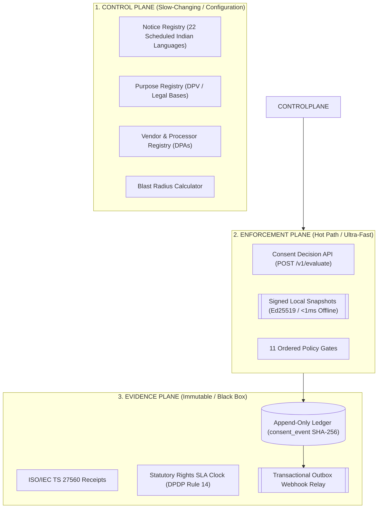

# UDS Group Consent & Privacy Control Plane
## Comprehensive Product Overview, Architecture & Developer Integration Manual

*Version 2.0 | Production Documentation | Updater Services Limited (UDS) Group*

---

## 1. Executive Product Overview

### 1.1 What is the UDS Consent & Privacy Control Plane?
The **UDS Consent & Privacy Control Plane** is a centralized, multi-tenant, enterprise privacy engineering platform built specifically for the **Updater Services Limited (UDS)** corporate group and its operating subsidiaries:

- **Updater Services Limited (UDS Parent)**: Integrated Facilities Management (IFM), Business Support Services (BSS), and workforce operations.
- **Denave India Pvt Ltd** (& international step-downs in UK, Malaysia, Singapore, Korea): B2B sales enablement, running **DenCRM**, **DenSFA**, **iSFA**, **myDEN**, telesales, retail audits, and data enrichment.
- **Matrix Business Services India Pvt Ltd**: Employee background verification (BGV), education, and court record checks.
- **Athena BPO Private Ltd**: High-volume inbound/outbound contact center operations.
- **Avon Solutions & Logistics**, **Global Flight Handling Services (GFHS)**, **Washroom Hygiene Concepts (WHC)**, and **Fusion Foods**.

```
┌──────────────────────────────────────────────────────────────────────────────────────┐
│                              UDS PRIVACY CONTROL PLANE                               │
├──────────────────────────────────────────────────────────────────────────────────────┤
│  1. Centralized Policy & Taxonomy  │ 2. Sub-Millisecond Decision Engine              │
│     (22 Indian Languages + DPV)    │    (<1ms Signed Offline Snapshots / 4ms API)    │
├────────────────────────────────────┼─────────────────────────────────────────────────┤
│  3. Immutable Evidence Ledger      │ 4. Double-Layer Tenant Isolation                │
│     (SHA-256 Parent-Child Chaining)│    (Spring EntityAccessGuard + PostgreSQL RLS)  │
└────────────────────────────────────┴─────────────────────────────────────────────────┘
```

---

### 1.2 Why Commercial SaaS CMPs (OneTrust, Kavach, CookieYes) Fail for UDS
Standard commercial Consent Management Platforms (CMPs) are designed for single-website cookie banners. They fail for UDS Group because:

1. **Multi-Entity Legal Accountability**: Under India's **Digital Personal Data Protection (DPDP) Act, 2023**, each UDS subsidiary is an independent Data Fiduciary. A data breach or audit inspects the subsidiary's records independently. Commercial tools blend multi-brand data in a shared cloud database.
2. **Offline Field-Force Operations**: Thousands of Denave field sales reps (using DenSFA/iSFA) visit retail outlets in basements and rural areas with zero connectivity. Standard CMPs require continuous HTTP access. UDS issues **cryptographically signed local snapshots (Ed25519)** evaluated in-memory on the device in **0.1 milliseconds**.
3. **High-Frequency Telesales & APIs**: Athena BPO automated dialers place 50+ calls/second. A 300ms third-party API latency would crash the dialer. The UDS Decision API executes 11 ordered legal gates in **single-digit milliseconds**.
4. **Third-Party Data Provenance**: Denave's B2B data-services vertical uses purchased/appended contact lists. The UDS engine tracks *chain-of-custody provenance*, verifying that third-party data carries lawful collection basis before outreach.
5. **Tamper-Evident Burden of Proof**: Under DPDP Section 6(10), the burden of proof sits entirely on the Data Fiduciary. UDS stores consent events in an **append-only, SHA-256 hash-chained ledger** (similar to a Git commit log), preventing retroactive record alterations.

---

## 2. Architecture: How It Was Made

The platform is structured into **three distinct planes** with strict separation of concerns:



### 2.1 The 11-Gate Policy Engine (`POST /v1/evaluate`)
Whenever an application asks *"Is this processing allowed?"*, the decision engine evaluates 11 ordered gates:
1. **Jurisdiction Module**: Resolves applicable statute (DPDP India, GDPR UK, Malaysia PDPA, Singapore PDPA, US State Laws).
2. **Suppression Gate**: Checks active do-not-contact / global suppression hashes.
3. **Purpose Validity**: Confirms the purpose code exists and is active in the registry.
4. **Legal Basis**: Validates consent, legitimate employment use, or statutory requirement.
5. **Consent Grant State**: Verifies the subject's latest state in the materialized projection.
6. **Notice Freshness**: Checks if a material notice update requires re-consent.
7. **Child / Minor Gate**: Enforces DPDP Section 9(1) — blocks consent-based processing for minors unless guardian verification is recorded.
8. **Application Authorization**: Checks if the calling application is permitted to execute this purpose.
9. **Vendor Authorization**: Checks if the target third-party vendor has an active DPA on file.
10. **TRAI TCCCPR Gate**: Enforces India telecom 90-day promotional calling expiry.
11. **GPC / Universal Opt-Out**: Respects Global Privacy Control signals.

---

## 3. The Front-End Applications

Two distinct web applications have been built and verified in `frontend/`:

```
                                  ┌───────────────────────────────┐
                                  │      TWO SEPARATE WEB APPS    │
                                  └───────┬───────────────┬───────┘
                                          │               │
                     ┌────────────────────┘               └────────────────────┐
                     ▼                                                         ▼
  ┌──────────────────────────────────────────────┐          ┌──────────────────────────────────────────────┐
  │ 1. COMPLIANCE CONSOLE (Internal Back-Office) │          │ 2. DATA PRINCIPAL PORTAL (Public-Facing)     │
  ├──────────────────────────────────────────────┤          ├──────────────────────────────────────────────┤
  │ • URL: http://localhost:3000                 │          │ • URL: http://localhost:3001                 │
  │ • Audience: DPO, Legal, Entity Admins        │          │ • Audience: Citizens, Customers, Employees   │
  │ • Auth: OIDC PKCE (Keycloak / Entra ID)      │          │ • Auth: ZERO Login (Anti-enumeration design) │
  │ • Surface:                                   │          │ • Surface:                                   │
  │   - Global Dashboard & Residency Map         │          │   - 22-Language Privacy Notice Reader        │
  │   - Statutory 30-Day Rights SLA Queue        │          │   - Self-Service DSR Intake Form             │
  │   - Subject Evidence Timeline & ISO Receipts │          │   - One-Time Verification (OTP) Screen       │
  │   - Notice Publisher & Blast Radius Engine   │          │   - Live Request Status & Receipt Tracker    │
  │   - Vendor & RoPA Registries Hub             │          │                                              │
  │   - Cryptographic Sweepers Control           │          │                                              │
  └──────────────────────────────────────────────┘          └──────────────────────────────────────────────┘
```

---

## 4. Developer Integration Playbook: How Other UDS Apps Implement This

### 4.1 Do applications need a complex install?
**No.** There are three straightforward integration options depending on the application stack:

| Application Type | Recommended Integration Pattern | Effort |
|---|---|---|
| **Backend Services & Web APIs** (DenCRM, Athena Dialer, Matrix Core) | **Pattern A**: Call the REST Decision API (`POST /v1/evaluate`) | 1–2 hours |
| **Mobile & Offline Field Apps** (DenSFA, iSFA, myDEN, Kiosks) | **Pattern B**: Cache & verify **Signed Local Snapshots** (Ed25519) | Half-day |
| **Downstream Data Stores** (CRMs, Marketing DBs, Data Warehouse) | **Pattern C**: Subscribe to **Outbox Webhooks** for real-time withdrawals | 1 hour |

---

### 4.2 Pattern A: REST Decision API (Backend Microservices)

Before performing any data processing (e.g. sending an email, dialing a phone number, sharing data with a vendor), the application makes a single HTTP call.

#### Java / Spring Boot Integration Example:
```java
package com.uds.dencrm.service;

import org.springframework.stereotype.Service;
import org.springframework.web.client.RestClient;
import java.util.Map;

@Service
public class ConsentEnforcementService {

    private final RestClient consentClient;

    public ConsentEnforcementService(RestClient.Builder builder) {
        this.consentClient = builder
            .baseUrl("http://consent-control-plane:8080")
            .defaultHeader("Authorization", "Bearer " + System.getenv("UDS_API_TOKEN"))
            .build();
    }

    /**
     * Checks whether DenCRM is allowed to send a marketing email to a customer.
     */
    public boolean canSendMarketingEmail(String phoneOrEmailHash) {
        Map<String, Object> request = Map.of(
            "entityId", "DENAVE_IN",
            "subjectId", phoneOrEmailHash,
            "applicationId", "DENAVE_CRM",
            "purposeCode", "DIRECT_MARKETING_EMAIL",
            "jurisdiction", "IN"
        );

        Map response = consentClient.post()
            .uri("/v1/evaluate")
            .body(request)
            .retrieve()
            .body(Map.class);

        return "ALLOW".equals(response.get("decision"));
    }
}
```

---

#### Node.js / TypeScript Integration Example:
```typescript
import axios from 'axios';

const CONSENT_API_URL = process.env.CONSENT_API_URL || 'http://localhost:8080';
const API_TOKEN = process.env.UDS_CONSENT_TOKEN;

interface DecisionResponse {
  decision: 'ALLOW' | 'DENY';
  reason?: string;
  applicableLaw?: string;
}

export async function isProcessingAllowed(
  entityId: string,
  subjectHash: string,
  applicationId: string,
  purposeCode: string
): Promise<boolean> {
  try {
    const { data } = await axios.post<DecisionResponse>(
      `${CONSENT_API_URL}/v1/evaluate`,
      {
        entityId,
        subjectId: subjectHash,
        applicationId,
        purposeCode,
        jurisdiction: 'IN'
      },
      {
        headers: {
          Authorization: `Bearer ${API_TOKEN}`,
          'Content-Type': 'application/json'
        }
      }
    );

    return data.decision === 'ALLOW';
  } catch (error) {
    // Fail-closed for marketing/tracking; fail-open only for essential security purposes
    console.error('Consent Decision Engine unreachable:', error);
    return false;
  }
}
```

---

#### Python Integration Example:
```python
import os
import requests

CONSENT_API = os.getenv("CONSENT_API_URL", "http://localhost:8080")
TOKEN = os.getenv("UDS_CONSENT_TOKEN")

def check_telesales_consent(phone_hash: str) -> bool:
    """Checks if Athena BPO is allowed to dial a contact under TRAI & DPDP rules."""
    payload = {
        "entityId": "ATHENA",
        "subjectId": phone_hash,
        "applicationId": "ATHENA_DIALER",
        "purposeCode": "DIRECT_MARKETING_VOICE",
        "jurisdiction": "IN"
    }
    
    headers = {
        "Authorization": f"Bearer {TOKEN}",
        "Content-Type": "application/json"
    }
    
    resp = requests.post(f"{CONSENT_API}/v1/evaluate", json=payload, headers=headers)
    if resp.status_code == 200:
        return resp.json().get("decision") == "ALLOW"
    return False
```

---

### 4.3 Pattern B: Offline Field Apps (DenSFA / iSFA Mobile SDK)

For field apps running on Android/iOS tablets where internet connectivity is intermittent:

```
[Morning App Start] ──► Server fetches Signed Snapshot from GET /v1/snapshot/{entityId}/{subjectId}
                                  │
                                  ▼
[Offline In-Memory] ──► Mobile SDK verifies Ed25519 signature locally in 0.1ms (NO Network needed!)
```

```typescript
// React Native / Mobile Field Implementation
import { verifySnapshotSignature } from '@uds/mobile-consent-sdk';

// 1. Snapshot cached locally in encrypted SQLite
const cachedSnapshot = await getLocalEncryptedSnapshot(subjectId);

// 2. Immediate 0.1ms verification with bundled public key
const isSignatureValid = verifySnapshotSignature(
  cachedSnapshot.payload,
  cachedSnapshot.signature,
  BUNDLED_PUBLIC_KEY
);

if (isSignatureValid && cachedSnapshot.payload.purposes['attendance_geofence'] === 'GRANTED') {
  // Proceed with retail audit photo capture
  enableLocationAndCamera();
}
```

---

### 4.4 Pattern C: Downstream Outbox Webhook Listener (Real-Time Withdrawals)

When a data principal withdraws consent via the public portal or an SMS link, the UDS platform instantly sends an HMAC-SHA256 signed webhook to registered systems.

#### Webhook Payload Received by DenCRM:
```json
{
  "eventId": "evt_98124a9c81",
  "eventType": "CONSENT_WITHDRAWN",
  "entityId": "DENAVE_IN",
  "subjectId": "e3b0c44298fc1c149afbf4c8996fb92427ae41e4649b934ca495991b7852b855",
  "purposes": ["DIRECT_MARKETING_EMAIL", "DIRECT_MARKETING_VOICE"],
  "timestamp": "2026-08-21T04:30:00Z"
}
```

#### DenCRM Webhook Receiver (Node.js / Express):
```javascript
app.post('/api/webhooks/uds-consent', (req, res) => {
  const { eventType, subjectId, purposes } = req.body;

  if (eventType === 'CONSENT_WITHDRAWN') {
    // Instantly suppress contact in DenCRM marketing lists
    db.contacts.updateMany(
      { phoneHash: subjectId },
      { $set: { marketingOptOut: true, optOutDate: new Date() } }
    );
  }

  res.status(200).json({ received: true });
});
```

---

## 5. Summary Table: What Changes Does an Application Need?

| Application | What Changes? | Exact Integration Steps |
|---|---|---|
| **DenCRM** | Add pre-send hook for email/campaign dispatch | 1. Hash contact email/phone with SHA-256.<br/>2. Call `POST /v1/evaluate`.<br/>3. Expose webhook endpoint for `CONSENT_WITHDRAWN`. |
| **DenSFA / iSFA** | Cache signed local snapshot upon login | 1. Fetch snapshot during sync.<br/>2. Evaluate location and marketing purposes locally in-memory. |
| **Athena Dialer** | Add pre-dial API check | 1. Call `/v1/evaluate` before placing automated calls.<br/>2. Respect `TRAI_CONSENT_EXPIRED` reason codes. |
| **Matrix BGV** | Add candidate consent intake & DPA check | 1. Call `POST /v1/consent` when candidate signs digital consent.<br/>2. Check `/v1/evaluate` before sending files to third-party court record search vendors. |

---

## 6. How to Run & Demo the Entire Platform

### Step 1: Start the Backend Service
```bash
cd platform
mvn -B test # Runs 610 unit & integration tests on PostgreSQL 17
```

### Step 2: Start the Frontend Applications
```bash
cd frontend

# Launch Compliance Console (Port 3000)
npm run dev:console

# Launch Data Principal Portal (Port 3001)
npm run dev:portal
```

### Step 3: Run the End-to-End Production Demo Flow
1. **Public Notice & Intake**: Open `http://localhost:3001` $\rightarrow$ switch language to Hindi/Tamil $\rightarrow$ submit a Rights Request for Denave India.
2. **Identity Verification**: Enter the generated 6-digit OTP code $\rightarrow$ verify token redemption.
3. **Compliance Console**: Open `http://localhost:3000` $\rightarrow$ login as DPO $\rightarrow$ see the new request appear in the **Statutory Rights Queue** with its live 30-day SLA countdown.
4. **Subject Evidence Audit**: Open **Subject Evidence** $\rightarrow$ inspect the SHA-256 parent-child hash chain and ISO 27560 receipts.
5. **Blast Radius Simulation**: Open **Notices** $\rightarrow$ edit notice to v2 $\rightarrow$ click **Calculate Blast Radius** to see automated downstream re-consent calculation.
