# UDS Group — Consent & Privacy Control Plane
## Final Plan: Architecture, Phases, Delivery

*Version 2.0 · 15 August 2026 · Supersedes prior drafts in `docs/`*

---

## Context

UDS Group (Updater Services Ltd, NSE: UDS) must be able to prove, per individual and per purpose, that every use of personal data across nine-plus group entities rests on a valid legal basis. India's **DPDP Rules 2025** (G.S.R. 846(E), notified 13 Nov 2025) make substantive obligations enforceable **13 May 2027** — ~21 months out. Penalties reach **₹250 crore per violation**, doubleable under s.33.

The group's exposure is unusual because three subsidiaries run business models that *are* personal-data processing: Denave (B2B contact database + telemarketing across 5 countries), Matrix (background verification), Athena BPO (outbound contact centre, ~3,000 seats).

This plan synthesizes four prior research documents in `docs/`, corrects several load-bearing errors, and adds one regulatory regime that none of them covered but which binds the group's core revenue activity today.

---

## What changed from the prior drafts

### ✅ Kept (the prior work was right)

The **three-plane architecture** (Control / Enforcement / Evidence), **signed consent snapshots** for offline-first field apps, **purpose-separated-from-data** modelling, **append-only hash-chained ledger**, **version chain with automatic blast-radius computation**, **vendor + processing registries**, **hierarchical multi-tenancy with policy inheritance**, **acquisition onboarding as a first-class workflow**, **PII-minimal ledger**, **OS-permission-vs-consent distinction**, and **`failure_behavior` per purpose**. These are genuinely strong and I've carried them through largely intact. The verified entity table with ownership percentages is also retained.

### ➕ Added (material gaps in all four documents)

| Addition | Why it matters |
|---|---|
| **TRAI TCCCPR 2018 + Feb 2025 amendments** | **The single biggest gap.** Not mentioned once across ~217KB of prior planning. Denave and Athena run outbound telemarketing in India — TRAI is the most *actively enforced* communications regime in the country, with live penalties and disconnection powers. It also imposes consent mechanics no prior draft modelled: **explicit transactional consent expires in 7 days**; **inferred consent is valid only for the duration of the contractual relationship**; **DLT registration** for sender IDs/templates; mandatory **DND/NCPR scrubbing** before every campaign |
| **Singapore DNC Registry, UK TPS/CTPS** | Denave has two Singapore entities and a UK entity. DNC checking is mandatory before any telemarketing contact |
| **DPDP s.7(i) legitimate uses** | All four drafts treat the ~76,000-person workforce as a *consent* problem. It largely isn't — routine employment processing and processing to safeguard the employer from loss/liability need **no consent**. Workforce is mostly a **notice, transparency, rights and retention** problem. This is a significant scope *reduction* |
| **MeitY Business Requirement Document for Consent Management** (NeGD, 6 June 2025) | Mentioned once in passing in `deep-research-report.md`, then dropped. It is the **Government of India's own functional and technical spec** for a DPDP consent management system. Not legally binding, but building against it is the strongest available compliance posture — and it is what a regulator will recognise |
| **`tsi-coop/tsi-dpdp-cms`** | Apache-2.0, Java/Maven, 413 commits, explicitly **built from the MeitY BRD**. Ships RoPA, multilingual policy publishing, grievance with statutory timelines, breach workflows, s.9 parental consent, consent ledger, REST validation APIs, webhooks, Single/Aggregator modes, and a legal module for court-ready evidence. **This changes the build-vs-buy calculus** — see §7 |
| **Denave's live privacy-policy gaps** | Its published policy still cites the superseded *"Personal Data Protection Bill"*, and names Google Analytics + Facebook Analytics with **no cookie banner or consent controls** — behind a UK entity. That is a present-tense UK GDPR/PECR exposure, fixable in days |
| **DPDP Rule 15 / Rule 13 mechanics** | Cross-border is a **blacklist** model (permitted except where government restricts); no restricted list published yet. Rule 13 lets government bar offshore transfer of specified categories for SDFs |
| **Korea PIPA separate consent** | Not just "another jurisdiction row" — PIPA requires **separate, itemised** consent per purpose and again for sensitive data and automated decision-making. **Bundled consent is invalid.** This is a hard architectural constraint on the notice renderer |
| **`c15t/c15t`** | Apache-2.0, ~1.9k stars, commits as of today, with a genuinely self-hostable backend. Currently the strongest OSS option for the web capture layer |

### ✏️ Corrected

| Claim in prior drafts | Correction |
|---|---|
| *"civil penalties for Consent Manager duty failures can reach ₹500 crore"* | Imprecise. The Act's **Schedule caps at ₹250 crore** (security-safeguard failures). The ₹500 cr figure comes from **s.33's power to enhance up to twice the standard quantum** in serious cases — it is not a Consent-Manager-specific ceiling. Penalties are assessed **per violation**, so a single incident breaching several obligations compounds |
| *Phase 3 = "14 May 2027"* (§2.1 of `UDS_Group_...`) | **13 May 2027**. Elsewhere the same doc says 13 May — reconcile to 13 May |
| *"Phase 2 (13 Nov 2026): enforcement powers and the penalty framework activate"* | Overstated. What commences 13 Nov 2026 is **Rule 4 — Consent Manager registration**. Since UDS is explicitly *not* pursuing Consent Manager registration, **this date does not bind us** |
| *Microsoft Consent Package as an exemplar to build from* | Microsoft explicitly labels it **"a sample."** 1 star, packages unpublished to npm. Useful for patterns (proxy consent, age flows, pluggable storage) — **not a foundation** |
| *Klaro as a recommended widget* | **Last updated March 2025 — stale.** Prefer `c15t` |
| *"consent receipts (IAB's Transparency and Consent Framework)"* (`deep-research-report.md`) | Conflation. Consent receipts are **Kantara → ISO/IEC TS 27560**. IAB TCF is an adtech signalling framework — an adapter, never the core model |
| *"the DPDP Act is not yet in force (pending official notification)"* (`deep-research-report.md`) | Outdated — written pre-Nov 2025. Superseded by the later drafts |
| **`FinalUDS_...` §15 and §16 do not exist** | The document references a discovery questionnaire (§15) and open decisions (§16) in three places, but jumps §14 → §17. The Phase 0 table row is also truncated (`| Now |; data-flow mapping`). Content reconstructed in §10 and §11 below |

### ⏱️ Re-baselined

Prior drafts target **Phase 1 complete "before Nov 2026"** — three months from now — covering Consent Ledger, Purpose Registry, Application Registry, Vendor Registry, Decision API, 22-language notice engine, web/app SDK *and* admin RBAC. That is not achievable, and it is anchored to a date that does not apply to us (Consent Manager registration, which we are not pursuing). **The only date that binds UDS is 13 May 2027.** Timeline below is re-baselined accordingly, with a deliberate buffer.

---

## 1. Scope decisions

| Decision | Choice |
|---|---|
| Purpose | **Internal compliance platform.** UDS entities act as Data Fiduciaries — *not* a registered DPDP Consent Manager |
| Domains | **All four:** B2B prospect + outreach, web/cookie/marketing, workforce, BGV candidate |
| Rollout | **Denave pilot first**, then group-wide by risk |
| Sourcing | ⚠️ **OPEN — decision gate end of Phase 1** |

### ⚠️ Open decision — sourcing

> Per your direction: *"either hybrid or self-host. Not buying a single enterprise platform. Since we are developers. Let's keep this open for some time and then decide."*
>
> Buying a single enterprise platform as the whole answer is **ruled out**. The architecture below makes this deferral **free** — everything below the ingestion API is ours regardless. See §7 for the decision criteria, which now includes a third option the prior drafts didn't consider.

---

## 2. Group entity map

| Entity | UDS stake | Function | Consent surface |
|---|---|---|---|
| **Updater Services Ltd** | Listed parent (₹640cr IPO, Sept 2023) | IFM + Business Support Services | ~76,000 workforce; group rollup view |
| **Denave India** | 89.57% | Demand gen, telesales, field sales, retail audit, digital marketing, **data services**. 5 international step-downs (UK, Malaysia, Singapore ×2, Korea) | **Highest.** `DenCRM`, `DenPRM`, `DenSFA`, `iSFA Connect` (Play + App Store), `myDEN Connect`, `DenTrack`. Clients incl. Microsoft, HUL, Saint-Gobain, Vivo |
| **Matrix Business Services** | 100% | Employee background verification, assurance. India's #3 BGV (~5.4% share) | **High.** Candidate consent *is* the legal basis |
| **Athena BPO** | 73.50% | Inbound/outbound contact centre, back-office, data processing. ~3,000 seats, 11 languages | **High.** Outbound dialling + processor role |
| **Global Flight Handling** | 83.25% | Airport/airline ground support | Frontline workforce, airside biometric access |
| **Avon Solutions & Logistics** | 76% | Mailroom (logistics vertical halted Q3 FY26, ₹23cr provision) | Moderate |
| **Fusion Foods & Catering** | 100% | Institutional catering | Facility workforce |
| **Washroom Hygiene Concepts** | 100% | Hygiene services | Facility workforce + B2B customer |
| **Wynwy Technologies** | 100% | Staffing ops (ex-Integrated Technical Staffing, merged FY24–25) | Workforce |
| **UDS Foundation** | 100% | Section 8 CSR | Minimal; in registry for completeness |

Tangy Supplies and Stanworth Management were absorbed into UDS (merger effective May 2025). **Entity structure changes through M&A — the platform must treat entities as configuration, never as hard-coded structure.**

### The four consent problems

1. **Digital/marketing consent** — Denave campaigns, group websites
2. **Product-embedded enforcement** — DenCRM/DenSFA/iSFA/myDEN must ask permission before acting, not just log
3. **Workforce** — large distributed blue-collar base, biometric attendance. *Mostly s.7(i) notice, not consent*
4. **Consent provenance** for purchased/appended contact data — **no commercial CMP handles this at all**

---

## 3. Regulatory drivers

### 3.1 India — DPDP Act 2023 + Rules 2025 (primary)

| Phase | Date | Activates |
|---|---|---|
| 1 | 13 Nov 2025 | Rules 1, 2, 17–21. DPBI constituted; definitions live |
| 2 | 13 Nov 2026 | Rule 4 — Consent Manager registration. **Does not bind UDS** |
| 3 | **13 May 2027** | Rules 3, 5–16, 22–23. **Everything that binds us** |

**Note:** the DPBI still has **no appointed Chairperson or Members** despite MeitY notifications (6 May, 6 June 2026). Build **interop-ready, not interop-dependent**.

**Rule 3 notice** — each item is a schema field, not prose: itemised data description; specified purpose with goods/services described; plain language; English or any of 22 Eighth Schedule languages; a **specific link** to withdraw, exercise rights, and complain to the Board. Withdrawal must be **as easy as giving**.

**s.6 valid consent:** free, specific, informed, unconditional, unambiguous, by clear affirmative action. No pre-ticked boxes, silence, or inactivity. **Burden of proof sits with the Fiduciary.**

**s.7(i) legitimate uses:** employment processing, and processing to safeguard the employer from loss/liability, need **no consent**. → Workforce scope is notice + rights + retention.

**s.9 children:** under-18, verifiable parental consent, **no behavioural tracking or targeted advertising at children**.

**Rule 8:** dark patterns explicitly prohibited — pre-selection, disguised refusal, confirm-shaming. → Design-review gate before any consent UI ships.

**Rule 15 cross-border:** blacklist model — permitted except where restricted; no list published yet. **Rule 13:** government may bar offshore transfer of specified categories for SDFs. → Host in India, keep residency configurable per entity.

**SDF status:** designated by notification only. No self-classification, no threshold. Given scale and Denave's data business, **design to SDF grade anyway**: India-resident DPO, annual DPIA + audit, algorithmic due diligence.

**MeitY BRD (NeGD, 6 June 2025)** — the government's own functional spec: consent lifecycle (collect → validate → update → renew → withdraw), user dashboard, notifications, grievance redressal, admin role management, retention configuration. Purpose-specific (**no bundling**), granular, English + Eighth Schedule. **Adopt as our functional requirements baseline.**

### 3.2 TRAI TCCCPR — the missing regime

Binds Denave and Athena's core revenue activity, enforced far more actively than DPDP is today:

- **DLT registration** mandatory for sender IDs and templates; no A2P SMS without it
- Promotional contact requires **explicit, documented** consent
- **Inferred consent valid only for the duration of the contractual relationship**
- **Explicit transactional consent expires after 7 days**
- **DND / NCPR scrubbing** before every campaign

→ Consent is a **time-series with expiry semantics**, not a boolean. Any schema storing consent as a flag is wrong on day one.

### 3.3 Other jurisdictions

- **UK/EU GDPR** — B2B outreach can rest on legitimate interest with a documented LIA, clear identification, honoured opt-out. **ePrivacy/PECR still requires consent for trackers regardless.** Germany requires consent for B2B cold email; France permits LI with opt-out
- **EU Digital Omnibus** (19 Nov 2025) — proposed GDPR Arts. 88a/88b absorbing cookie rules. AI-Act half adopted by Council 29 June 2026; **GDPR/ePrivacy half still contested — Council's June 2026 text dropped both the browser-signal and single-click provisions.** Earliest realistic force late 2027. **Do not hard-code current or proposed cookie rules**
- **Korea PIPA** — strictest. **Separate, itemised consent per purpose**, and again for sensitive data and automated decision-making. Bundling is invalid
- **Singapore PDPA** — mandatory **DNC Registry** check before telemarketing
- **Malaysia PDPA (Amendment) 2024** — **biometric data = sensitive** (fingerprint, face, voice, retinal, gait); mandatory DPO from 1 June 2025; breach notification; **direct statutory liability extended to processors**
- **CCPA/CPRA** — Denave's own policy already claims California coverage

**Architectural consequence:** the core data model must be **jurisdiction-agnostic** (purpose, legal basis, consent artefact, withdrawal event) with a **jurisdiction-specific policy layer on top**. All four prior drafts converged on this independently — good sign it's right.

---

## 4. Design principles

1. **Consent as a platform, not a banner.** The banner is the thinnest layer; the API/event layer is the product
2. **Centralized policy and evidence, distributed fast enforcement.** Configure once centrally; decide locally in sub-millisecond time
3. **One consent-artefact model, many jurisdictional policies.** Shape on **DEPA/ReBIT** (ORGANS: Open, Revocable, Granular, Auditable, Notice, Security) — Indian regulators already speak this vocabulary
4. **Standards-based records.** **ISO/IEC TS 27560:2023** for record + receipt structure; **ISO/IEC 29184:2020** for the notice layer; **W3C DPV** for the purpose/legal-basis vocabulary. Do not invent field names
5. **Append-only. Never overwrite state.** `marketing: false` is not a fact you edit — it's a materialized view over `GRANTED → WITHDRAWN → GRANTED`. This is what satisfies the burden of proof
6. **Policy-as-code.** One `POST /v1/evaluate` endpoint (OPA/Rego or equivalent), not five teams reimplementing "can I contact this person" inconsistently
7. **Real-time propagation.** Withdrawal fans out over an event bus. No manual scripts
8. **Separate PURPOSE from DATA.** Not "location = allowed" but "GPS location, for field-attendance verification" as distinct from "GPS location, for marketing personalisation"
9. **Offline-first for field apps.** iSFA and retail-audit tools must work with no connectivity: signed local snapshot + encrypted store + event queue + idempotency key + sequence number
10. **PII-minimal.** The ledger stores `subject_id`, not name/email/phone. It answers "did subject X consent to Y" — it must not become a second master customer database
11. **Built for entities, not just the group.** Every record carries `data_fiduciary_entity_id`. The group dashboard is a rollup; the entity is the unit of legal accountability
12. **Consent has expiry semantics.** TRAI's 7-day transactional window and contract-lifetime inferred consent are first-class, not edge cases

---

## 5. Architecture

### 5.1 Three-plane model

```mermaid
flowchart TB
    subgraph Control["CONTROL PLANE — slow-changing, admin-configured"]
        PURPOSE[Purpose Registry<br/>versioned · legal basis per jurisdiction]
        NOTICE[Notice Registry<br/>22 languages · immutably versioned<br/>ISO 29184]
        VENDOR[Vendor / Processor Registry]
        APPREG[Application Registry<br/>entity · env · platform]
        JURIS[Jurisdiction Policy Modules<br/>DPDP · TRAI · GDPR · PIPA · PDPA]
    end

    subgraph Capture["CAPTURE LAYER — swappable"]
        WEB[Web SDK / banner]
        FIELD[Field SDK<br/>DenCRM · DenSFA · iSFA · myDEN]
        VOICE[IVR / telesales script hook]
        KIOSK[Attendance / biometric kiosk]
        BGVF[BGV candidate consent forms]
        BULK[Bulk import<br/>provenance-tagged]
    end

    INGEST[["Consent Ingestion API — ONE contract"]]

    subgraph Decision["ENFORCEMENT PLANE — hot path"]
        DEC[Decision API<br/>POST /v1/evaluate<br/>policy engine]
        SNAP[[Signed consent snapshots<br/>local · offline-capable]]
        SUPP[Suppression Service<br/>DND/NCPR · SG DNC · UK TPS/CTPS<br/>global + per-client opt-out]
    end

    subgraph Evidence["EVIDENCE PLANE — immutable"]
        LEDGER[(Consent Ledger<br/>append-only · hash-chained<br/>ISO 27560 · 7-yr retention)]
        PROV[Provenance Store<br/>source · basis · acquisition date]
        DSR[Rights Engine<br/>access · correct · erase · grievance]
        INTEROP[Consent Manager<br/>interop gateway — dormant]
    end

    BUS[[Event Bus]]

    subgraph Down["CONSUMING SYSTEMS"]
        CRM[DenCRM / DenPRM]
        SFA[DenSFA / iSFA / myDEN]
        DIAL[Dialer / campaign tools]
        HRMS[HRMS / attendance]
        DW[Warehouse / analytics]
    end

    subgraph Console["COMPLIANCE CONSOLE"]
        DASH[Group + per-entity dashboards]
        ROPA[RoPA · DPIA · breach log]
        AUDIT[Regulator-ready export]
    end

    PURPOSE --> DEC
    NOTICE --> DEC
    VENDOR --> DEC
    APPREG --> DEC
    JURIS --> DEC

    WEB --> INGEST
    FIELD --> INGEST
    VOICE --> INGEST
    KIOSK --> INGEST
    BGVF --> INGEST
    BULK --> INGEST

    INGEST --> LEDGER
    BULK -.provenance.-> PROV
    LEDGER --> DEC
    PROV --> SUPP
    DEC --> SNAP
    SUPP --> DEC

    LEDGER --> BUS
    BUS --> CRM
    BUS --> SFA
    BUS --> DIAL
    BUS --> HRMS
    BUS --> DW

    DSR --> LEDGER
    LEDGER --> DASH
    LEDGER --> ROPA
    LEDGER --> AUDIT
    INTEROP <--> LEDGER
```

**Everything below the Ingestion API is ours and vendor-independent.** Everything in the Capture layer is replaceable. This is what makes the sourcing decision free to defer.

### 5.2 Canonical data model

- **Subject** — privacy-minimal `subject_id`; identifiers stored **hashed** (phone hash, email hash, employee ID, device ID). Supports cross-entity *linking* without merging unrelated business data
- **Data Fiduciary Entity** — each independently reportable and auditable
- **Application** — one row per app/environment/platform (`iSFA / Production / Android`), owned by an entity
- **Purpose** — controlled taxonomy (never free text), versioned, mapped to legal basis **per jurisdiction**. Carries `failure_behavior` (fail-open / fail-closed) and `expiry_policy` (none / fixed-days / contract-lifetime)
- **Data Category** — kept explicitly separate from Purpose
- **Processing Activity** — links purpose to system
- **Notice** — versioned, per-language, per-jurisdiction. Every consent record points to the exact version rendered. **We must reproduce in 2031 precisely what a person saw in 2026**
- **Consent Artefact** — ISO 27560-shaped: who, purpose, notice version, how obtained, validity window, current state
- **Consent Event** — immutable: `GRANTED / MODIFIED / WITHDRAWN / EXPIRED / INVALIDATED`, each with actor, channel, timestamp, monotonic sequence number, and hash of prior event
- **Consent Receipt** — the individual-facing copy
- **Provenance Record** — for purchased/appended data: source, original collection basis, acquisition date, evidence pointer. **The field no commercial CMP has**
- **Vendor / Processor** — data categories, purposes, countries, DPA reference, allowed applications, consent requirement
- **Suppression Entry** — channel, scope (global / entity / client / campaign), source (DND, DNC, TPS, manual, inbound opt-out), effective date

### 5.3 Consent status and conflict resolution

`GRANTED / DENIED / WITHDRAWN / NOT_ASKED / EXPIRED / INVALIDATED / PENDING_SYNC / CONFLICTED / UNKNOWN`

Resolve disagreements by **monotonic event sequence number, not wall-clock timestamp** — clock skew across a distributed field-force fleet is a real failure mode, not a theoretical one.

### 5.4 Versioning and blast radius

Consent given against Notice v3 / Purpose v5 is not consent to v7/v9. Every record carries a version chain: **Notice → Purpose → Policy → Application**. When legal changes a notice, the platform **computes the blast radius automatically** — which applications need re-consent, which need a notice-update flag, which need no action. Most CMPs make you work this out manually; this is genuinely differentiating.

### 5.5 Performance and enforcement

- **Signed consent snapshots** — on login/app-start/config-change, the server issues a small cryptographically signed JSON object stating purpose-by-purpose status, policy version, issuer and signature. Devices and downstream services verify **without a network call**
- **Offline-first** — encrypted local store + event queue + idempotency key + sequence number; sync on reconnect
- **Target SLOs** (validate by load test): local evaluation p95 **< 1ms**; Decision API p95 **< 30ms**; control-plane p99 < 100ms; availability 99.99%
- **Fail-open vs fail-closed defined per purpose, not improvised per app.** Security/auth may fail open under approved policy; **marketing, analytics, location fail closed**
- **OS permissions ≠ consent.** Final capability = UDS consent **AND** OS permission (Android runtime / Apple ATT) **AND** application authorization. The SDK exposes the *combined* state

### 5.6 Security

AES-256 at rest, TLS 1.3 in transit, envelope encryption via managed KMS/HSM. Hash-chain per subject (tamper-evident, **not** a public blockchain — that buys nothing here). Per-entity RBAC/ABAC: a Matrix admin must not see Denave records. **Admins never silently edit historical consent — append an event, never overwrite.** Admin actions are themselves audited. mTLS or signed-JWT service-to-service auth on the Decision API. India-hosted ledger for DPDP-scoped entities; UK/Malaysia/Singapore/Korea flows documented as explicit cross-border transfers.

---

## 6. Tech stack

- **Control plane** — Java 21 + Spring Boot (matches likely UDS skillsets and the TSI option; mature OAuth2/OIDC + RBAC ecosystem)
- **Transactional store** — PostgreSQL, partitioned by entity + time, row-level security for multi-tenancy
- **Event stream** — Kafka: `CONSENT_GRANTED`, `CONSENT_WITHDRAWN`, `CONSENT_EXPIRED`, `POLICY_PUBLISHED`, `NOTICE_PUBLISHED`, `SUPPRESSION_ADDED`
- **Cache** — Redis: snapshots, policy/app config, snapshot-verification public keys
- **Evidence store** — S3-compatible object storage, India region, for consent evidence (signed PDFs, call recordings, form snapshots) and audit exports
- **Policy engine** — OPA/Rego or equivalent
- **Auth** — OAuth2/OIDC + JWT via Keycloak or Azure AD for admins; OTP or group SSO for data principals
- **Observability** — Prometheus, OpenTelemetry, Grafana
- **SDKs (phase 1)** — TypeScript/JS, Kotlin, Swift, Flutter, React Native, plus REST. All wrap one shared **UDS Privacy Core** so business rules stay centralized; UI ships separately so Denave's, Matrix's and WHC's surfaces can differ
- **Hosting** — India region (AWS `ap-south-1` / Azure Central India), residency configurable per entity for Rule 13 headroom
- **Later, only if load data justifies** — split the hot-path decision engine into Go or Rust. Do not start there

---

## 7. Sourcing — three options, decision at end of Phase 1

The prior drafts framed this as buy / build / hybrid. The TSI finding adds a fourth, better option.

| Option | Assessment |
|---|---|
| **Buy single enterprise platform** | **Ruled out** by your direction |
| **A. Self-host + build** | `c15t` (Apache-2.0, active) for the web capture layer; build everything else. Maximum control, lowest licence cost, all roadmap burden ours |
| **B. Hybrid** | Commercial CMP for web/cookie + DSR portal; build ledger, decision point, suppression, provenance |
| **C. TSI-anchored ⭐ evaluate first** | Fork or adopt **`tsi-coop/tsi-dpdp-cms`** (Apache-2.0, Java/Maven, 413 commits) for the **DPDP-native compliance modules** it already ships — RoPA, multilingual policy publishing, grievance with statutory timelines, breach workflows, s.9 parental consent, consent ledger, validation APIs, court-ready evidence module — and build the **group orchestration layer** (multi-entity hierarchy, decision point, suppression, provenance, SDKs) on top. It is built from the MeitY BRD and its Java stack matches §6 |

**Why C deserves a hard look:** it collapses the highest-effort, lowest-differentiation work (22-language notice rendering, grievance SLA tracking, breach workflows, RoPA) into adopted code that is already aligned to the government's own spec — leaving our build effort concentrated on what is genuinely unique to UDS. Caveat: 12 stars means **low external validation** — a code and security audit is a Phase 0 gate before committing.

**Decision criteria at the Phase 1 gate.** Choose **hybrid (B)** if any hold:
- RoPA reveals >15 distinct consent collection surfaces
- Group sites need IAB TCF (i.e. programmatic advertising is live)
- Sustained engineering capacity < 2 FTE
- 22-language notice rendering proves costlier to build than to buy

Otherwise **A or C**, decided by the Phase 0 TSI audit outcome.

### Reference implementations to study

| Project | Licence | Use |
|---|---|---|
| **`tsi-coop/tsi-dpdp-cms`** | Apache-2.0 | **Evaluate as foundation** — MeitY BRD-aligned, DPDP-native |
| **`c15t/c15t`** | Apache-2.0 | Best current web capture layer; real self-hostable backend |
| `68publishers/consent-management-platform` | Open | Closest OSS analogue to a real backend — study schema + admin console |
| `osano/cookieconsent` | Open | Most widely deployed banner; UX + Consent Mode patterns |
| `tagticians/consent-management-platform` | Open | Event-driven propagation pattern for the Decision API |
| `microsoft/Consent-Package` | MIT / CC-BY-SA-4.0 | **A sample, not a framework.** Patterns only: proxy consent, age flows, pluggable storage |
| `kiprotect/klaro` | BSD-3 | **Stale since Mar 2025.** Fallback reference only |
| DEPA / ReBIT AA specs (Sahamati) | — | Best real-world precedent for the artefact model. Model on it; don't weld to AA transport |
| W3C DPV | — | Purpose / legal-basis vocabulary seed |

---

## 8. Phased delivery

Start Sept 2026. Hardening complete ~Feb 2027 — **~3-month buffer before 13 May 2027**.

### Phase 0 — Foundation & quick wins (wks 1–6)
- **RoPA per entity** across all ten. Expect systems nobody remembers
- **Purpose × jurisdiction × legal-basis matrix** drafted; legal sign-off gates Phase 1 exit
- India-resident **DPO** appointed; SDF-readiness gap assessment
- **TSI DPDP CMS code + security audit** → feeds the §7 decision
- **Quick win:** correct Denave's privacy policy (DPDP Act 2023, not the superseded Bill) and ship a cookie banner on `denave.com`. Closes a live UK GDPR/PECR gap in days
- **Denave prospect-database triage begins now, not in Phase 2** — see §12
- Inventory integration targets: DenCRM, DenPRM, DenSFA, iSFA, myDEN, DenTrack, Athena dialer, HRMS, BGV workflow

### Phase 1 — Core platform (wks 5–16)
- Consent Ledger: ISO 27560 schema, hash chain, append-only enforced **by DB grants, not convention**
- Purpose / Notice / Vendor / Application registries; 22-language notice rendering
- Consent Ingestion API — the stable contract every surface writes to
- Decision API + Redis cache + signed snapshot issuance
- Admin RBAC, per-entity isolation
- **🔀 Sourcing decision gate**

### Phase 2 — Denave pilot (wks 14–30)
The hardest entity first, deliberately.
- **Prospect provenance backfill** — classify every contact record by source and lawful basis. **Unsubstantiable records are quarantined, not grandfathered**
- Suppression Service + TRAI DND/NCPR, Singapore DNC, UK TPS/CTPS; DLT template registration
- Dialer, DenCRM and campaign tools call the Decision API as a **blocking** pre-flight check
- iSFA / DenSFA offline-first SDK with signed snapshots
- Web consent live across Denave domains
- Korea PIPA separate-consent flows; UK/EU LIAs documented

### Phase 3 — Rights & governance (wks 24–36)
- DSR portal + grievance workflow with statutory SLAs, federated across entities
- Breach detection and notification workflow (DPDP Rule 7; Malaysia PDPA)
- Automated retention and erasure enforcement
- ISO 27560 consent receipts issued to data principals
- Blast-radius / re-consent impact engine

### Phase 4 — Group rollout (wks 32–60)
Sequenced by risk:
1. **Matrix** — BGV candidate consent artefacts (consent *is* the basis here)
2. **Athena BPO** — outbound dialling + processor-role pass-through
3. **UDS core + Wynwy** — workforce notices, biometric attendance, retention. *Mostly s.7(i) notice work*
4. **GFH, Avon, Fusion Foods, WHC**

### Phase 5 — Hardening & audit (wks 55–75)
- DPIA per high-risk activity; independent third-party audit; Rule 13 algorithmic due diligence
- Penetration test of ledger integrity and rights portal
- Consider ISO/IEC 27701 certification
- Board attestation pack

### Deferred to V2+ (explicit anti-scope-creep constraint)
Privacy CI/CD gate and SDK inventory scanner; AI governance module; full data discovery/DLP; full GRC/vendor-risk platform; universal cookie scanner; registered public Consent Manager offering; acquisition-onboarding toolkit refinement. **Build an excellent Consent / Preference / Policy / Notice / Identity / Audit / Enforcement / SDK core first.**

---

## 9. Verification

**Ledger integrity**
- Automated hash-chain verification job; any break alarms
- Property test: **no code path can UPDATE or DELETE a consent event** — enforced by DB grants
- Restore from backup, re-verify chain end to end

**Decision correctness** — golden suite per jurisdiction:
- TRAI: transactional consent auto-denies at day 8; inferred consent denies after contract end
- Korea PIPA: bundled consent request is **rejected at ingestion**
- DPDP: withdrawal takes effect immediately; s.7(i) purposes allow without consent record
- GDPR: LI permits until opt-out, then denies
- Negative tests: withdrawn → `deny`; expired → `deny`; unknown subject → `deny` for fail-closed purposes

**End-to-end per phase**
- Consent on `denave.com` → ledger event → withdraw in preference centre → **dialer's Decision API flips to `deny` within cache TTL**
- Contact with no provenance → campaign scrub excludes it
- iSFA in airplane mode → local snapshot answers correctly → queued event syncs on reconnect
- DSR filed → federated retrieval across systems, SLA tracked

**Regulatory**
- Reproduce exact notice text + language a given principal saw on a given date
- Generate consent receipt; validate against ISO 27560 structure
- **Dry-run audit:** pick 20 random contacts, produce full lawful-basis evidence for each
- Map every MeitY BRD functional requirement to an implemented feature

**Performance**
- Local evaluation p95 < 1ms; Decision API p95 < 30ms under Denave dialer peak
- Suppression scrub throughput at full database size

---

## 10. Phase 0 discovery questionnaire

*(Reconstructing §15, missing from `FinalUDS_...`.)* Per entity, in working sessions with business + legal:

1. Which applications, websites and mobile apps do you own? Environments and platforms for each?
2. What personal data does each collect, and for what stated purpose?
3. Which are you a **Data Fiduciary** for, and which a **Processor** for a client?
4. What client contracts impose consent or data-handling obligations that flow down to us?
5. Where does contact data come from — direct collection, client-supplied, purchased, appended, scraped?
6. What evidence exists for each source? Who holds it?
7. Which outbound channels do you use (call, SMS, WhatsApp, email), in which countries?
8. Are you DLT-registered? Who scrubs against DND/NCPR today, and how often?
9. What biometric or attendance data is captured, on what devices, retained how long?
10. Which third parties/processors receive personal data? Is there a signed DPA?
11. What retention rules exist today — documented or de facto?
12. How does someone currently withdraw consent or file a grievance? What is the SLA?
13. What is the current KavachOne/ConsentiQo footprint, and what does it actually cover?

---

## 11. Open decisions requiring UDS leadership

1. **Sourcing** — A / B / C per §7. Gate: end of Phase 1. *(Your explicit request to keep open.)*
2. **KavachOne/ConsentiQo** — full replacement, or retain for one entity's public site while the group platform becomes system of record? Materially changes Phase 0 scope. Note KavachOne has stated intent to register as a Consent Manager in Nov 2026 — if UDS stays a customer, that changes the relationship
3. **SDF legal opinion** — which entity, if any, gets designated? Most plausibly Denave. Changes the audit/DPIA bar
4. **Denave prospect-database remediation budget** — see §12. This is a commercial decision, not a technical one
5. **Consent Manager registration as a Denave business line** — deliberately out of scope here, but Denave's client base and India incorporation make it plausible. Worth its own evaluation. Note the Act bars a Consent Manager from also being Fiduciary/Processor for the same individuals — a real structural constraint
6. **Fail-open vs fail-closed defaults** — needs a signed-off policy per purpose class, not per-team improvisation

---

## 12. Risks

| Risk | Mitigation |
|---|---|
| **Denave's prospect database has unsubstantiable provenance** | **The single biggest commercial risk in this programme.** Assume a material share fails. Quarantine, don't grandfather. Budget for re-permissioning campaigns. **Surface to leadership in Phase 0, not Phase 2** — it may affect revenue guidance, and leadership should hear it from us first |
| TRAI enforcement lands before DPDP | Genuinely likely — TRAI acts today. Suppression + DLT compliance is Phase 2, but **DND scrubbing discipline should be verified in Phase 0** |
| Taxonomy churn after Phase 1 | Legal sign-off gates Phase 1 exit. Version the taxonomy; never mutate in place |
| Decision API becomes a production bottleneck | Local snapshots keep it off the hot path. Explicit written fail-open/fail-closed policy per purpose |
| TSI adoption brings unvetted code | Phase 0 security + code audit is a hard gate before any commitment |
| SDF designation arrives mid-build | Already designing to SDF grade; residency configurable per entity |
| Ten entities, ten sets of priorities | Denave pilot proves the model first; one shared taxonomy prevents divergence |
| Scope creep into a full privacy suite | Explicit V2+ deferral list in §8 |
| EU Digital Omnibus shifts under us | Policy-configurable consent-basis engine; never hard-code cookie rules |

---

## 13. What makes this genuinely industry-grade

1. It survives a DPB audit of **any single UDS entity independently**
2. It answers "who consented to what, when, under which notice version, and how do we prove it" in **seconds, not a data-pull project**
3. Withdrawal **stops processing everywhere, same day, automatically**
4. It has an answer for **data Denave didn't collect directly** — most competitors, including Kavach, don't
5. It enforces **TRAI's expiry semantics natively** — most CMPs can't express "this consent dies in 7 days"
6. An acquisition becomes a **configuration change**, not a rewrite
7. When the Consent Manager ecosystem matures, UDS plugs in **in weeks**

---

## Notes carried forward

- **Sourcing stays open** per your explicit request. Buying a single enterprise platform is ruled out. Revisit at the Phase 1 gate, informed by the Phase 0 TSI audit. *(Persist to project memory on exiting plan mode.)*
- Prior drafts remain in `docs/` for provenance. This document supersedes them; `deep-research-report.md` in particular contains pre-Nov-2025 statements that are now outdated.
- On approval, this plan can also be written into `docs/` as the working reference.
