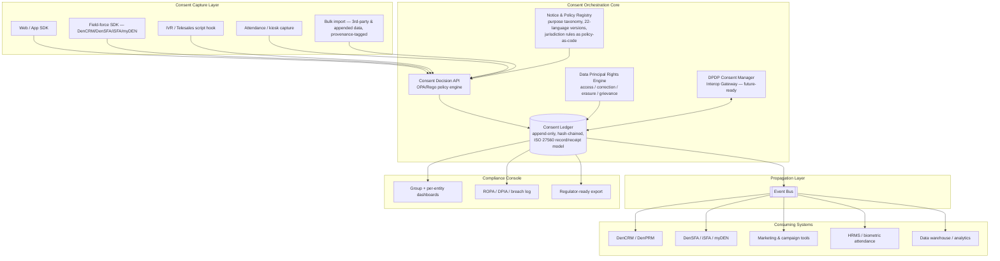

# UDS Group Consent Management System — Research & Architecture Plan

*Prepared for: Updater Services Limited (UDS) group | Scope: enterprise-wide consent & preference management*

---

## 0. Assumption Stated Up Front

You asked for a system "better than Kavach." Kavach — properly, **KavachOne's ConsentiQo** — is a well-marketed, India-first **DPDP consent SaaS product**, built for *one organisation, one legal entity, one set of digital touchpoints* (a website/app cookie banner + DSAR workflow + ROPA/DPIA automation). It is a good tool for what it is designed for.

UDS is not "one organisation." It's a **listed parent (UDS) with ~7 operating subsidiaries** (Denave, Matrix, Avon, Washroom Hygiene Concepts, Global Flight Handling, Athena BPO, Fusion Foods), each with its own brand, client contracts, and data flows — spanning **field-force B2B sales tech (DenCRM/DenSFA/iSFA/myDEN)**, **~lakhs of blue-collar IFM/security workforce**, **background-verification data (Matrix)**, and **outsourced consumer marketing/telesales run on behalf of Denave's own clients** (Microsoft, HUL, Vivo, etc.). A single-tenant cookie-banner SaaS product cannot be "pointed at" this and solve it. What UDS actually needs is an **internal Consent & Preference orchestration layer** that sits *underneath* (or replaces parts of) tools like Kavach — a group-wide "consent switchboard," not a bigger banner.

**This plan is written on that assumption.** I've flagged the two or three places where the answer genuinely depends on a decision only UDS's legal/compliance/CTO leadership can make (see §12, Open Decisions).

---

## 1. UDS Group — What I Found

| Entity | What it does | Why it matters for consent design |
|---|---|---|
| **Updater Services Ltd (UDS)** — parent, NSE-listed (₹640 cr IPO, FY2024) | Integrated Facilities Management (IFM, ~66% of revenue) + Business Support Services (BSS, ~34%) | Multiple legal entities under one listed parent → each is likely a separate **Data Fiduciary** under DPDP; consent records must be entity-attributable, not just group-attributable |
| **Denave** (100% owned since Aug 2024) | Sales enablement: demand generation, telesales, field sales/marketing, retail audits, digital marketing, database/data services — for clients like Microsoft, HUL, Saint-Gobain, Vivo. Operates in India, Europe, Malaysia, Singapore | Denave is often the **data processor** for its own clients' end-consumers *and* runs its own contact databases ("Intelligent Data Services") — meaning two consent problems stacked: (a) consent for Denave's own field staff/CRM users, (b) **consent provenance** for third-party/purchased/appended B2B and consumer contact data used in campaigns |
| **Denave products**: DenCRM, DenPRM (partner relationship mgmt), DenSFA / Sales Force Automation, **iSFA Connect** (your "ISFA"), **myDEN Connect** (likely your "Maiden" — mishear of *myDEN*), DenTrack | These are the systems where consent needs to be *enforced*, not just recorded — e.g., a field rep's app shouldn't be able to pull a retailer's phone number for a marketing purpose that was never consented to |
| **Matrix Business Services** | Employee background verification + business assurance/audit (India's #3 in BGV, ~5.4% share) | Background checks touch **verifiable identity, criminal, and employment history data** — DPDP doesn't have a GDPR-style "special category," but this is exactly the class of processing that draws DPB scrutiny first |
| **Washroom Hygiene Concepts, Avon (mailroom), Global Flight Handling, Athena BPO, Fusion Foods (catering)** | Facility-level and BPO services | Large **frontline/blue-collar workforce** — biometric attendance (fingerprint/face) is now explicitly "sensitive" under Malaysia's amended PDPA and is a natural flashpoint under DPDP too, even without a formal sensitive-data tier |

**Net read:** UDS's consent problem is really **four different problems wearing one trenchcoat** — (1) digital/marketing consent for Denave's campaigns, (2) product-embedded consent inside DenCRM/DenSFA/iSFA/myDEN, (3) workforce consent across a very large distributed employee base, (4) consent *provenance* for third-party contact data. Any plan that only solves #1 (which is what most CMPs, including Kavach, are built for) will look compliant on a website and still be exposed everywhere else.

---

## 2. Regulatory Landscape (as it stands, August 2026)

### 2.1 DPDP Act, 2023 + DPDP Rules, 2025 — the primary driver

<cite index="35-1">The Ministry of Electronics and Information Technology formally notified the DPDP Rules, 2025 on 13 November 2025, operationalising the Act's provisions on consent, notice, rights, and breach reporting.</cite> Rollout is phased:

| Phase | Date | What activates |
|---|---|---|
| Phase 1 | 13 Nov 2025 (immediate) | Data Protection Board of India constituted; core definitions live |
| Phase 2 | <cite index="36-1">13 Nov 2026</cite> | <cite index="36-1">Enforcement powers, penalty framework, and Consent Manager registration open</cite> |
| Phase 3 | <cite index="31-1">14 May 2027</cite> | Full compliance deadline — consent, notice, security safeguards, and data-principal rights all enforceable |

Two details that should directly shape your build timeline:
- <cite index="31-1">As of mid-2026 the Data Protection Board of India had not yet appointed a Chairperson or Members, and there is no settled rule for how the DPDP Consent Manager regime will interact with the existing RBI-regulated Account Aggregator ecosystem</cite> — meaning the *external* Consent Manager framework you'd interoperate with is itself still being built. Build your system to be **interop-ready, not interop-dependent**.
- <cite index="26-1">KavachOne itself states it intends to register as a certified Consent Manager once registration opens in November 2026</cite> — worth knowing if UDS continues as a Kavach customer for any component.

**What counts as valid consent (Section 6):** <cite index="62-1">free (not coerced or bundled), specific (tied to a defined purpose), informed (preceded by a Section 5 notice), unconditional, and unambiguous via a clear affirmative action — pre-ticked boxes, silence, or inactivity do not qualify</cite>. <cite index="59-1">Withdrawal must be as easy as giving consent, and the withdrawal must be processed within a period comparable to how the original consent was given; the data fiduciary bears the burden of proof for consent</cite>.

**Children (Section 9):** <cite index="58-1">consent for a data principal who is a child must come from a parent, and fiduciaries must not carry out behavioural tracking or targeted advertising directed at children</cite>. <cite index="60-1">"Child" means anyone under 18, and processing requires *verifiable* parental consent.</cite>

**Notice (Section 5) and language:** <cite index="65-1">the notice preceding consent must be available in English or any of the 22 languages listed in the Eighth Schedule to the Constitution of India.</cite> This is a real product requirement, not a nice-to-have — your notice-rendering layer needs to be a translation/versioning system from day one.

**Dark patterns:** <cite index="58-1">DPDP Rules 2025, Rule 8 explicitly prohibits dark patterns in consent UX, with examples, and violations attract penalties.</cite>

**Consent Manager (Section 6(8), Rule 6):** <cite index="65-1">a registered intermediary — modelled on the RBI Account Aggregator — that lets a data principal give, view, manage, and withdraw consent across multiple fiduciaries through one interoperable platform, using a standardised "consent artefact."</cite> <cite index="27-1">Consent Managers are barred from acting as a data fiduciary or processor for the same data principals they serve, to avoid conflicts of interest; violating this can mean suspension or cancellation of registration.</cite>

**Consent Ledger for Significant Data Fiduciaries:** <cite index="65-1">the Rules require Significant Data Fiduciaries to maintain detailed, interconnected consent logs — commonly referred to as a Consent Ledger.</cite> UDS should get a legal opinion on whether any group entity (most plausibly Denave, given consumer-data volume) will be classified SDF — it changes the audit/DPIA bar materially.

**Penalties:** figures vary by source and by which obligation is breached — <cite index="27-1">civil penalties under Section 27 can reach ₹500 crore for Consent Manager duty failures</cite>, and <cite index="21-1">general commentary puts breach-related exposure as high as ₹250 crore per incident</cite>. Treat both as "this is boardroom-level risk," not a compliance checkbox.

### 2.2 GDPR — relevant because Denave operates in Europe

GDPR consent basics you already know (freely given, specific, informed, unambiguous, Art. 7 withdrawal, Art. 8 child consent at 16 with member-state variance down to 13). What's *live* right now and worth tracking:

<cite index="73-1">On 19 November 2025 the European Commission published the "Digital Omnibus," the most substantial proposed GDPR amendment since 2018, moving cookie/tracking rules from the ePrivacy Directive into new GDPR Articles 88a/88b, and allowing consent to be expressed automatically via browser-level signals in specified cases</cite>. <cite index="67-1">The proposal would require a single-click accept/reject option in banners and bar re-prompting for the same purpose for six months after a user declines</cite>. <cite index="68-1">As of mid-2026 the AI-Act half of the Omnibus has been adopted, but the GDPR/ePrivacy half remains under negotiation, with the Council's working text currently dropping the core cookie-consent provisions</cite> — so **don't hard-code today's cookie rules; build a policy-configurable consent-basis engine**, because the EU rules under it are actively moving.

### 2.3 Malaysia & Singapore PDPA — relevant because Denave has offices there

<cite index="85-1">Malaysia's 2024 PDPA amendment classifies biometric data (fingerprints, facial recognition) as sensitive personal data, requiring explicit consent, stricter security, and inclusion in data-processing records</cite> — directly relevant to any biometric attendance system UDS/Matrix runs for its workforce. <cite index="84-1">From 1 June 2025, Malaysian organisations must appoint a Data Protection Officer and provide breach notification "as soon as practicable," and the amendment extends direct statutory liability to data processors, not just controllers</cite> — relevant if any UDS entity acts as a processor for a Malaysian client. Singapore's PDPA has its own parallel obligations (consultation on financial-sector digital marketing rules is ongoing per the same sweep of sources); treat SG as its own jurisdiction row in your compliance matrix rather than assuming India rules cover it.

### 2.4 Practical takeaway

You are not building for one law. You're building a system whose **core data model must be jurisdiction-agnostic** (purpose, legal basis, consent artefact, withdrawal event) with a **jurisdiction-specific policy layer on top** (India: 22-language notice, Consent Manager interop, no sensitive-data tier but child=18; EU: cookie/ePrivacy convergence in flux, child age varies by state; Malaysia: biometric = sensitive, processor liability; Singapore: its own regime). This is the single most important architectural decision in this whole plan.

---

## 3. Why a Generic CMP (Kavach or otherwise) Won't Cover This

| What Kavach/ConsentiQo-class tools do well | What UDS additionally needs |
|---|---|
| Single-brand cookie/website consent banner, 22-language notices, DSAR workflow, ROPA/DPIA templates | **Multi-tenant, multi-entity** consent — same platform, 7+ legal entities, each with its own notices, purposes, and audit trail, rolling up to one group view |
| Consent capture on **digital** touchpoints (web/app) | Consent capture on **field/offline** touchpoints: retail audit tablets, IVR/telesales scripts, in-person sales rep sign-up, biometric attendance kiosks, paper forms later digitised |
| Records consent *given by the user directly to the fiduciary* | **Consent provenance for third-party/purchased data** — when Denave buys or appends a contact list for a demand-gen campaign, the platform needs to track *whose* consent it's relying on, not just record a fresh one |
| Consent stored, visible in a compliance dashboard | Consent **enforced at the API layer** inside DenCRM/DenSFA/iSFA/myDEN in real time — i.e., a downstream system should be able to ask "can I message this contact for purpose X" and get a policy decision, not just a record it has to interpret itself |
| Built for one regulatory regime (DPDP-first) | Native multi-jurisdiction (India + EU + Malaysia + Singapore) with a policy layer, because Denave already operates in all four |

This is also roughly how the market is segmenting right now: India-specific DPDP point-solutions (KavachOne/ConsentiQo, ConsentOS, Consentin, CookieYes-India) are optimising for fast DPDP compliance on a single site; global players (OneTrust, Usercentrics/Cookiebot, Osano, Didomi, TrustArc) are strong on GDPR/multi-region cookie consent but weaker on India-specific requirements (22-language notices, Consent Manager interoperability). **None of them are built to be an internal group orchestration layer across seven operating companies with a shared field-force product suite** — that's a genuinely custom problem, which is exactly why "better than Kavach" is achievable: you're not competing on cookie-banner polish, you're solving a problem those tools were never scoped to solve.

---

## 4. Reference Architecture

### 4.1 Design principles

1. **Consent as a platform, not a banner.** The banner/preference-center UI is the thinnest layer. The real product is the API/event layer everything else calls.
2. **One consent artefact model, many jurisdictional policies.** Borrow the shape of India's own **DEPA/Account Aggregator "consent artefact"** — <cite index="75-1">a machine-readable object naming the purpose, data categories, time-bound validity window, and revocability, stored encrypted with no plaintext</cite> — as your canonical internal schema, then layer DPDP/GDPR/PDPA-specific rules on top as policy, not as separate data models. <cite index="80-1">India's own Electronic Consent Framework already defines a consent artefact as a machine-readable document specifying the parameters and scope of data a user consents to</cite> — reuse this vocabulary rather than inventing your own; it also positions you well for DPDP Consent Manager interoperability later.
3. **Standards-based records, not a proprietary log.** Model consent records/receipts on **ISO/IEC TS 27560:2023**, which <cite index="38-1">defines an interoperable consent record structure covering what processing was consented to, which privacy notice was shown, how consent was obtained, and the full lifecycle of consent events (given, withdrawn, etc.), plus a matching "receipt" format to hand back to the individual</cite>, paired with **ISO/IEC 29184:2020** for the notice layer that precedes it. Reference implementations exist via the **W3C Data Privacy Vocabulary (DPV)**, which <cite index="40-1">was used directly in drafting ISO/IEC TS 27560:2023's JSON-LD examples</cite> — this gives you an actual open vocabulary to build your schema on instead of guessing at field names.
4. **Append-only, tamper-evident ledger.** Every consent event (grant, modify, withdraw, notice-version-shown) is an immutable, timestamped, hash-chained record — this is what actually satisfies DPDP's "burden of proof on the fiduciary" requirement and what a Consent Ledger for a Significant Data Fiduciary would need to look like.
5. **Policy-as-code enforcement**, not a database flag checked inconsistently by five different apps. Use a policy engine (e.g., **Open Policy Agent/Rego**, or an equivalent decision service) so that DenCRM, DenSFA, iSFA, myDEN, telesales dialers, and marketing tools all call one `POST /consent/decision` endpoint instead of five teams re-implementing "can I contact this person" logic differently (and inconsistently).
6. **Real-time propagation, not batch sync.** <cite index="26-1">Withdrawal has to update every connected system — CRM, marketing, analytics, processors, warehouses — without a manual step, or you have a compliance gap the moment someone forgets to run a script</cite>. Use an event bus (Kafka/similar) so a withdrawal event fans out to every subscriber in near-real time.
7. **Built for entities, not just for the group.** Every record carries a `data_fiduciary_entity_id` (UDS parent / Denave / Matrix / Avon / etc.) — the group dashboard is a rollup view, not the source of truth.

### 4.2 Core components

### 4.3 Canonical data model (minimum viable entities)

- **Data Principal** — the individual; supports identity resolution across subsidiaries (same phone number showing up in Denave's DB and Matrix's BGV system should be *linkable for consent purposes* without merging unrelated business data)
- **Data Fiduciary Entity** — UDS / Denave / Matrix / Avon / WHC / GFH / Athena / Fusion Foods, each independently reportable
- **Purpose** — a controlled taxonomy (not free text), versioned, mapped to legal basis per jurisdiction
- **Processing Activity** — links a purpose to a system (e.g., "DenSFA retail-audit photo capture" → purpose "retail compliance audit")
- **Notice** — versioned, per-language, per-jurisdiction; every consent record points to the exact notice version shown
- **Consent Artefact / Record** — ISO 27560-shaped: who, what purpose, what notice version, how obtained, validity window, current state
- **Consent Event** — immutable log entries: granted / modified / withdrawn / expired, each with actor, channel, timestamp, hash of prior state
- **Consent Receipt** — the individual-facing copy of the record (what a self-service dashboard shows a data principal or employee)
- **Provenance Record** — for any third-party/purchased/appended data: source, original collection consent basis (or legitimate-interest basis), acquisition date — this is the field most CMPs don't have at all and the one most likely to bite Denave's data-services business specifically

---

## 5. Build vs. Buy vs. Hybrid

| Approach | Fit for UDS |
|---|---|
| **Buy a DPDP point solution** (Kavach/ConsentiQo, ConsentOS, Consentin) | Fast, cheap, good for a single entity's website. Fails the moment you need cross-entity orchestration, field-force enforcement, or provenance tracking. Reasonable as a **stopgap for one subsidiary's public website**, not as the group system. |
| **Buy a global CMP** (OneTrust, Usercentrics/Cookiebot, Osano, Didomi) | Strong GDPR/multi-region cookie handling (useful for Denave Europe). Weak on DPDP-specific requirements (22-language notice, Consent Manager interop) out of the box, and still single-tenant-per-brand rather than a real multi-entity orchestration layer. |
| **Fully custom build, from zero** | Total control, but you'd be re-deriving standards (ISO 27560/29184, DPV) and re-solving problems (banner UX, geo-detection, translation pipelines) that mature open-source projects already solve well. Slow and higher-risk than it needs to be. |
| **Hybrid (recommended)** | **Reuse open-source at the edges, build custom at the core.** Use a mature open-source widget (e.g., Klaro, or `osano/cookieconsent`) for the actual web consent banner/preference UI — don't reinvent that. Build the **Consent Ledger, Decision API, Purpose Registry, and multi-entity data model in-house**, because that orchestration layer *is* the differentiated product UDS actually needs and nothing off-the-shelf provides it. |

### 5.1 Useful open-source references (what to actually look at, and why)

- **`kiprotect/klaro`** — <cite index="53-1">a simple, transparent consent-management widget that blocks third-party trackers until consent is granted, works even with JavaScript restrictions, and is fully self-hostable</cite>. Good reference for the *capture widget* layer, not the orchestration core.
- **`osano/cookieconsent`** — <cite index="52-1">the most widely deployed open-source consent banner project, seen roughly 2 billion times a month, actively maintained</cite>. Good for UX/interaction patterns and Google Consent Mode integration.
- **`68publishers/consent-management-platform`** — <cite index="51-1">a standalone, self-hosted CMP with its own database for storing per-user consent history, bulk provider/cookie management, multi-environment support (web *and* mobile app), and Azure AD auth</cite> — the closest open-source analogue to a "real backend," worth studying for schema and admin-console design even if you don't fork it directly.
- **`tagticians/consent-management-platform`** — <cite index="47-1">self-hosted with full Google Consent Mode v2 support and a documented JS event/state API (`CMP.getConsent()`, `CMP.onConsentChange()`, etc.)</cite> — good reference for the *event-driven propagation pattern* your Decision API should expose to downstream systems.
- **RBI Account Aggregator / DEPA specs (via Sahamati/ReBIT)** — not a GitHub repo, but the single best real-world precedent for exactly your problem shape: *India-specific, multi-entity, consent-artefact-based, interoperable-by-design*. <cite index="81-1">One practical engineering recommendation from teams building against this ecosystem: keep the consent artefact, its logs, and its purpose/duration metadata in a storage layer you own, modelled on the ReBIT artefact but not welded to the AA transport layer — so that if the Data Protection Board later adopts ReBIT-style standards for DPDP Consent Managers you've lost nothing, and if it doesn't, you're only swapping an adapter, not your data model.</cite> This is directly applicable advice for UDS's own consent ledger design.
- **W3C DPV (Data Privacy Vocabulary) Community Group** — the semantic vocabulary behind ISO 27560; use its purpose/processing/legal-basis taxonomy as a starting point for your Purpose Registry instead of building one from scratch.

---

## 6. Compliance Feature Checklist (map every feature to a clause)

| Feature | DPDP hook | GDPR hook | Why it's non-negotiable |
|---|---|---|---|
| Granular, purpose-separated consent (no bundling) | Section 6(1) | Art. 7(2), Recital 43 | <cite index="63-1">Pre-ticked boxes, bundled consent, and jargon-heavy forms are explicitly invalid</cite> |
| One-click / equal-ease withdrawal | <cite index="59-1">Section 6(4)</cite> | Art. 7(3) | Withdrawal harder than sign-up is a direct violation, not a UX nitpick |
| Notice in English + 22 scheduled languages | <cite index="65-1">Section 5, Rules 2025</cite> | Art. 12 (intelligible, plain language) | Field-force and blue-collar workforce notices genuinely need this — not just consumer-facing India |
| Verifiable parental consent for minors, no behavioural tracking of children | <cite index="58-1">Section 9</cite> | Art. 8 | Relevant if any Denave campaign touches under-18 audiences |
| Dark-pattern-free consent UX | <cite index="58-1">Rule 8</cite> | EDPB dark-pattern guidelines | Design review gate before any consent UI ships |
| Immutable audit trail, burden of proof on fiduciary | <cite index="59-1">Section 6(10)</cite> | Art. 7(1) | This *is* the Consent Ledger — see §4 |
| Consent Manager interoperability (future) | <cite index="65-1">Section 6(8), Rule 6</cite> | n/a | Build the artefact export/import API now, activate it when the DPB framework is live |
| Biometric = sensitive, explicit consent + heightened security | n/a directly (DPDP has no formal sensitive tier) | Art. 9 | <cite index="85-1">Malaysia's amended PDPA explicitly classifies biometric data as sensitive</cite> — build this as a policy flag now regardless of India's current gap, since it will almost certainly tighten |
| Data provenance / chain-of-custody for third-party data | Section 4 (necessity), general fiduciary accountability | Art. 5(2) accountability | Directly addresses Denave's data-services/appended-list exposure flagged in §1 |
| Per-entity breach notification workflow (72-hour class timelines referenced across sources) | Rule 7 | Art. 33/34 | One incident engine, entity-scoped outputs |

---

## 7. Security & Trust Architecture

- **Encryption**: AES-256 at rest, TLS 1.3 in transit, envelope encryption via a managed KMS/HSM; consent artefacts stored encrypted with no plaintext copies outside the ledger service, mirroring the AA-framework practice of encrypted, non-plaintext consent artefacts.
- **Immutability**: hash-chain each consent event to the previous event for that data principal (a lightweight internal ledger — you do not need a public blockchain for this, just tamper-evidence and provable ordering).
- **Access control**: zero-trust, per-entity RBAC — a Matrix admin should not be able to see Denave consent records and vice versa, even though both roll up to the same group dashboard.
- **Data residency**: keep the ledger and all compliance data hosted in India for DPDP-scoped entities; treat EU/Malaysia/Singapore data flows as explicit, documented cross-border transfers with their own legal basis, not an afterthought.
- **API security**: mTLS or signed-JWT service-to-service auth for the Consent Decision API, since every downstream system (DenCRM, DenSFA, telesales dialers) will be calling it constantly and it becomes a single point of both truth and failure — design for high availability accordingly.

---

## 8. Governance Model

- **Central Privacy/Consent Council**: one owner from Legal/Compliance, one from Security, one from Engineering, meeting to own the Purpose Registry (nobody adds a new "purpose" without this group signing off — this is what keeps the taxonomy from sprawling into chaos).
- **Per-entity Privacy Point of Contact**: each subsidiary (Denave, Matrix, Avon, etc.) names one accountable person, per DPDP's expectation that Data Fiduciaries designate a point of contact (Significant Data Fiduciaries need a formal DPO).
- **Change control on notices**: every notice text change is versioned and re-triggers consent capture for affected purposes — don't let a marketing copy edit silently invalidate your legal basis.

---

## 9. Phased Delivery Roadmap

Anchored to the two dates that actually matter externally: **Consent Manager interoperability opens 13 Nov 2026**, **full DPDP compliance deadline 13 May 2027**.

| Phase | Target | Scope |
|---|---|---|
| **0 — Discovery** (4–6 wks) | Now | Data-flow mapping and ROPA across all 7 entities; legal opinion on Significant Data Fiduciary status; decide Kavach's ongoing role (§12) |
| **1 — Core Ledger & Web/App Capture** | Before Nov 2026 | Consent Ledger, Purpose Registry, Decision API, web/app SDK (can reuse Klaro/cookieconsent-derived widget), notice-rendering engine with 22-language support |
| **2 — Product Integration** | Q1–Q2 2027 | DenCRM/DenSFA/iSFA/myDEN call the Decision API live; telesales/IVR and retail-audit field capture wired in; event-bus propagation to marketing tools and data warehouse |
| **3 — Workforce & Provenance** | Q1–Q2 2027 | HRMS/biometric attendance consent flows (Matrix + IFM workforce); third-party/appended-data provenance tagging for Denave's database services |
| **4 — Interop & Multi-jurisdiction** | Before May 2027 | DPDP Consent Manager artefact export/import gateway (activate once DPB framework stabilises); EU cookie-consent alignment (watching Digital Omnibus outcome); Malaysia/Singapore policy modules |
| **5 — Hardening & Certification** | Post-launch | External audit, penetration testing, consider ISO/IEC 27701 (privacy information management) certification alongside existing security certifications |

A note on execution: given you're already running **Claude Code and Codex CLI together on a large codebase with a token-efficiency workflow**, the Decision API, event-bus consumers, and multi-entity data model in Phases 1–3 are exactly the kind of well-bounded, spec-able microservices that scaffold well under that workflow — worth spinning up the Purpose Registry and Consent Ledger as an early proof-of-concept to validate the schema before wiring in DenCRM/DenSFA.

---

## 10. Standards & References to Build Against

- **ISO/IEC TS 27560:2023** — Privacy technologies: Consent record information structure (record + receipt schema; core reference for your Ledger)
- **ISO/IEC 29184:2020** — Online privacy notices and consent (notice-layer companion standard)
- **W3C Data Privacy Vocabulary (DPV)** — open semantic vocabulary underlying ISO 27560; use for your Purpose/Processing taxonomy
- **RBI Account Aggregator Master Directions / DEPA Electronic Consent Framework** — closest real-world precedent for a multi-entity, interoperable, consent-artefact-based Indian architecture
- **Digital Personal Data Protection Act, 2023 + DPDP Rules, 2025** (Sections 4–9, Rule 6, First Schedule) — primary legal driver
- **EU GDPR (Arts. 4, 6, 7, 8, 9, 12–14) + Digital Omnibus proposal (Nov 2025, in negotiation)** — for Denave's EU footprint; monitor rather than hard-code
- **Malaysia PDPA (Act 709) as amended 2024, Singapore PDPA** — for Denave's ASEAN footprint

---

## 11. What Would Make This Genuinely "Industry-Grade"

1. It survives a DPB audit of **any single UDS entity independently** — the platform being groupwide shouldn't blur which legal entity is accountable for what.
2. It answers "who consented to what, when, under which notice version, and how do we prove it" in **seconds, not a data-pull project**.
3. Withdrawing consent actually **stops processing everywhere**, same day, automatically — not "we'll update the CRM by Friday."
4. It has an answer for **data Denave didn't collect directly** (appended/purchased lists) — most competitors, including Kavach, don't.
5. It's designed so that **when** the DPDP Consent Manager ecosystem matures, UDS can plug into it in weeks, not re-architect.

---

## 12. Open Decisions (need UDS leadership/legal input, not something I can settle for you)

- **Does UDS intend to fully replace Kavach, or keep it for one entity's public-facing site while the group platform becomes the system of record underneath?** Changes Phase-0 scope materially.
- **Which entity, if any, will be classified a Significant Data Fiduciary?** Determines whether the formal Consent Ledger/DPO/independent-audit obligations apply now or are a "nice to have ahead of the curve."
- **Budget/timeline envelope and build team** — this plan assumes a multi-quarter internal engineering effort; worth sizing against the Phase 2 (Nov 2026) and Phase 3 (May 2027) regulatory dates above.
- **Does UDS want to eventually register as a licensed DPDP Consent Manager itself** (offering the platform beyond UDS, the way KavachOne plans to) or strictly as an internal system? The architecture in §4 supports either path, but the compliance/registration burden (Rule 6, First Schedule Part A/B) is much higher if you go external.

---

### Sources consulted
Company/group structure: UDS investor filings and subsidiary disclosures, Denave/UDS corporate sites. Regulatory: DPDP Act/Rules commentary (Tsaaro, DLA Piper Data Protection Laws of the World, Candour Legal, ProtectComply, Vratex, KSandK, WatchDog Security, GoTrust, Unified Chambers), EU Digital Omnibus coverage (Usercentrics, iGDPR, Priverion, Global Policy Watch), Malaysia/Singapore PDPA (InCorp Malaysia, MiHCM, Mayer Brown, Chambers & Partners, Sibermate). Standards: ISO/IEC TS 27560:2023 and 29184:2020 (ISO.org, W3C DPV Community Group, Springer/arXiv analyses). Architecture precedent: Sahamati (Account Aggregator SRO), AM Legals, HyperVerge, ecorpit. Open source: GitHub repositories for Klaro, osano/cookieconsent, 68publishers/consent-management-platform, tagticians/consent-management-platform. Market landscape: KavachOne/dpdpact.co.in product pages, ConsentOS.
